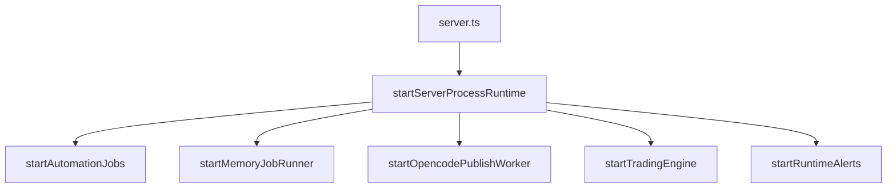
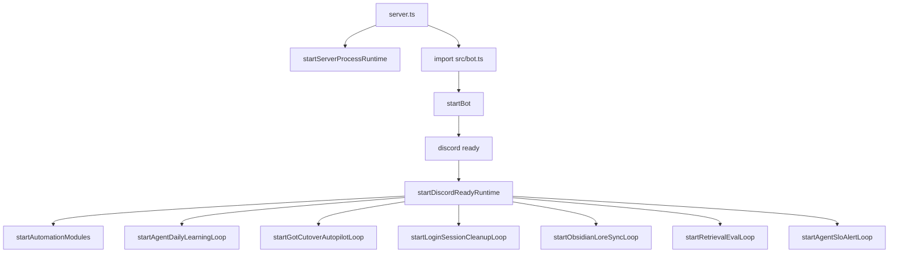
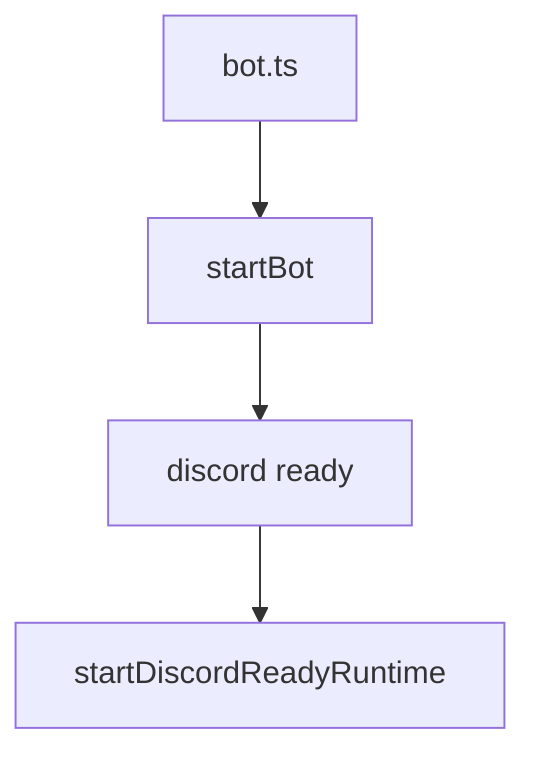

# Architecture Index

## Role Naming

> Role naming: `docs/ROLE_RENAME_MAP.md` | Runtime surface truth: `docs/RUNTIME_NAME_AND_SURFACE_MATRIX.md`

## Purpose

This document is the external analysis entrypoint for the backend repository.
It provides a stable map of runtime flow, domain boundaries, and data boundaries.

Control-plane ownership rule:

- shared Obsidian is the semantic cockpit: human-visible operations control, durable context, wiki, decision history, and graph-first navigation
- Supabase is the operational substrate: sessions, events, policy enforcement, cron, vector and hybrid retrieval, extension ops, structured analytics, and runtime diagnostics
- the design goal is not "Obsidian instead of Supabase" but "Obsidian explains and controls; Supabase executes and measures"
- future Supabase capability growth should happen by expanding the operational substrate, not by pushing semantic ownership out of Obsidian

Document Role:

- Canonical for repository runtime structure and service/data boundary map.
- Use this index to locate code surfaces before changing routes, runtime ownership, or persistence boundaries.
- Directional priority still comes from [docs/planning/UNIFIED_ROADMAP_SOCIAL_OPS_2026Q2.md](docs/planning/UNIFIED_ROADMAP_SOCIAL_OPS_2026Q2.md).

Primary operations entrypoint:

- `docs/RUNBOOK_MUEL_PLATFORM.md` (unified DevOps/SRE runbook)
- `docs/planning/UNIFIED_ROADMAP_SOCIAL_OPS_2026Q2.md` (social mapping + autonomous ops canonical roadmap)
- `docs/planning/EXECUTION_BOARD.md` (milestone-bound now/next/later execution board)
- `docs/OPERATOR_SOP_DECISION_TABLE.md` (who/when/threshold/action decision matrix)
- `docs/HARNESS_ENGINEERING_PLAYBOOK.md` (model runtime harness design)
- `docs/HARNESS_RELEASE_GATES.md` (go/no-go gates for harness quality)
- `docs/ONCALL_INCIDENT_TEMPLATE.md` (incident timeline template)
- `docs/ONCALL_COMMS_PLAYBOOK.md` (incident communications)
- `docs/POSTMORTEM_TEMPLATE.md` (post-incident review)
- `docs/planning/MULTI_AGENT_NODE_EXTRACTION_TARGET_STATE.md` (multiAgentService core split target state)
- `docs/planning/mcp/MCP_TOOL_SPEC.md` (MCP tool contract)
- `docs/planning/mcp/MCP_ROLLOUT_1W.md` (MCP rollout plan)
- `docs/planning/mcp/LIGHTWORKER_SPLIT_ARCH.md` (core-worker split)
- `docs/planning/OBSIDIAN_OPERATING_SYSTEM_BLUEPRINT.md` (vault-first operating system target state)
- `docs/planning/OBSIDIAN_OBJECT_MODEL.md` (canonical vault object families)
- `docs/planning/OBSIDIAN_TRANSITION_PLAN.md` (migration from current mixed control plane)
- `docs/planning/MANAGED_AGENTS_FOUR_LAYER_MODEL.md` (brain, hands, session, semantic owner overlay across Render, GCP, Supabase, and shared Obsidian)
- `docs/planning/LANGGRAPHJS_AGENTGRAPH_MIGRATION_PLAN.md` (current agentGraph naming correction + actual LangGraph.js migration plan)
- `docs/archive/LANGGRAPH_STATEGRAPH_BLUEPRINT.md` (historical LangGraph migration-ready state graph blueprint)
- `docs/archive/GOT_LANGGRAPH_EXECUTION_PLAN.md` (historical GoT reasoning + LangGraph execution rollout plan)
- `docs/planning/LOCAL_COLLAB_AGENT_WORKFLOW.md` (local IDE lead+consult agent workflow)

## Runtime Entrypoints

- `server.ts`: HTTP API process bootstrap.
- `bot.ts`: Discord bot-only process bootstrap.
- `src/app.ts`: Express middleware and route composition.
- `src/bot.ts`: Discord command/event runtime and bot orchestration.

## Domain Boundary Contracts

Cross-domain data flow rules that enforce transformation correctness at service boundaries:

- `docs/contracts/DISCORD_TO_MEMORY.md` — channel metadata, tag format, thread context
- `docs/contracts/MEMORY_TO_OBSIDIAN.md` — sanitization gate, frontmatter, adapter routing
- `docs/contracts/OBSIDIAN_READ_LOOP.md` — graph-first retrieval strategy
- `docs/contracts/DISCORD_SOCIAL_GRAPH.md` — community graph, private thread exclusion
- `docs/contracts/SPRINT_DATA_FLOW.md` — phase transitions, action scoping, retro writes

Context isolation map: `docs/CONTEXT_ISOLATION.md`

## Runtime Details

- `src/routes/bot.ts` + `src/routes/botAgentRoutes.ts`: bot control-plane routes split into core and agent composition boundary.
- `src/routes/bot-agent/*.ts`: agent domain routes (`core`, `runtime`, `got`, `qualityPrivacy`, `governance`, `tools`, `memory`, `learning`) registered by composer.
- `src/services/runtimeBootstrap.ts`: centralized startup boundaries for server process runtime and Discord-ready runtime.
- `src/services/superAgentService.ts`: structured super-agent facade that normalizes a supervisor task envelope, emits schema-aligned route output, and delegates execution to the existing session runtime.
- `src/services/entityNervousSystem.ts`: feedback-circuit integrator that connects session completion, reward trend, and sprint retro outputs back into long-term memory, behavior adjustment, and self-notes.

## Local IDE Collaboration Surface

This repository now defines a customization-level local collaboration surface for IDE work:

- `.github/agents/local-orchestrator.agent.md`
- `.github/prompts/local-collab-route.prompt.md`
- `.github/prompts/local-collab-consult.prompt.md`
- `.github/prompts/local-collab-synthesize.prompt.md`
- `.github/instructions/multi-agent-routing.instructions.md`

Role of this surface:

- choose a lead agent for local IDE work
- attach targeted consult agents without forcing a full delivery pipeline
- standardize `lead_agent`, `consult_agents`, `required_gates`, `handoff`, `escalation`, `next_action`

> This layer is control-plane guidance for local development, not a replacement for `src/services/multiAgentService.ts`.

## Customization vs Runtime Boundary

The repository currently uses the same role names across two different layers:

- customization/control-plane: `.github/agents/*`, `.github/prompts/local-collab-*.prompt.md`, `.github/instructions/multi-agent-routing.instructions.md`
- runtime execution: `src/services/superAgentService.ts`, `src/services/skills/actions/agentCollab.ts`, `src/services/skills/actions/registry.ts`, `src/services/skills/actionRunner.ts`, advisory role workers

Interpretation rule:

- role names such as Implement, Architect, Review, Operate, and Coordinate (and their legacy aliases OpenCode, OpenDev, NemoClaw, OpenJarvis, Local Orchestrator) are repository-local collaboration roles
- they do not by themselves prove that an upstream open-source system is installed, embedded, or directly executed by this repository
- runtime-backed behavior exists only where a registered action, worker URL, or HTTP/MCP transport is present in code and environment

Current runtime-backed collaboration surfaces:

- `coordinate.route` (legacy: `local.orchestrator.route`)
- `coordinate.all` (legacy: `local.orchestrator.all`)
- `architect.plan` (legacy: `opendev.plan`)
- `review.review` (legacy: `nemoclaw.review`)
- `operate.ops` (legacy: `openjarvis.ops`)
- `implement.execute` (legacy: `opencode.execute`)
- `tools.run.cli`

Current local tool/runtime facts:

- local Ollama provider usage is supported in `src/services/llmClient.ts`
- HTTP/MCP-style delegated workers are supported via `src/services/mcpWorkerClient.ts` and `scripts/agent-role-worker.ts`
- a first narrow local CLI tool slice exists via `src/services/tools/*` and `GET /api/bot/agent/tools/status`
- general-purpose discovery and wrapping of arbitrary local OSS CLIs/servers is not yet a first-class runtime layer in this repository

Planning note:

- keep collaboration-role documents focused on routing and handoff contracts
- keep runtime and operator truth in service code plus runtime status endpoints
- track future local external tool integration separately in `docs/planning/LOCAL_TOOL_ADAPTER_ARCHITECTURE.md`
- use `docs/RUNTIME_NAME_AND_SURFACE_MATRIX.md` when a role name could be confused with an external OSS/runtime/model name

## Runtime Loop Inventory (Current Code)

Canonical runtime loop snapshot:

- `src/services/runtime/runtimeSchedulerPolicyService.ts` (`getRuntimeSchedulerPolicySnapshot`)
- Operator API surface: `GET /api/bot/agent/runtime/scheduler-policy`

Startup phase `server-process` (via `startServerProcessRuntime` → `bootstrapServerInfrastructure`):

- `automation-jobs` (`src/services/automationBot.ts`)
- `memory-job-runner` (`src/services/memory/memoryJobRunner.ts`)
- `consolidation-loop` (`src/services/memory/memoryConsolidationService.ts`) — pg_cron 대체 가능
- `user-embedding-loop` (`src/services/memory/userEmbeddingService.ts`) — pg_cron 대체 가능
- `opencode-publish-worker` (`src/services/opencode/opencodePublishWorker.ts`)
- `runtime-alerts` (`src/services/runtime/runtimeAlertService.ts`)
- `bot-auto-recovery` (`src/services/runtime/botAutoRecoveryService.ts`)
- `sprint-pipeline-rehydration` (`src/services/sprint/sprintOrchestrator.ts`)
- `session-rehydration` (`src/services/multiAgentService.ts`)
- `event-sourcing-rehydration` (`src/services/sprint/eventSourcing/bridge.ts`)
- `sprint-scheduled-triggers` (`src/services/sprint/sprintTriggers.ts`)
- `mcp-skill-router` (`src/services/mcpSkillRouter.ts`)
- `sandbox-policy-sync` (`src/services/skills/actionRunner.ts`) — startup + 6h re-sync
- `adapter-auto-loader` (`src/services/tools/adapterAutoLoader.ts`) — M-15 동적 어댑터
- `signal-bus-consumers` (`src/services/runtime/signalBusWiring.ts`)
- `trust-decay-timer` (`src/services/sprint/trustScoreService.ts`) — Phase H, pg_cron 대체 가능
- `observer-loop` (`src/services/observer/observerOrchestrator.ts`) — Phase F, pg_cron 대체 가능
- `intent-formation` (`src/services/intent/intentFormationEngine.ts`) — Phase G

Startup phase `discord-ready` (via `startDiscordReadyRuntime` → `bootstrapDiscordLoops`):

- `automation-modules` (`src/services/automationBot.ts`)
- `agent-daily-learning` (`src/services/agent/agentOpsService.ts`)
- `got-cutover-autopilot` (`src/services/agent/agentOpsService.ts`)
- `login-session-cleanup` when owner=`app` (`src/discord/auth.ts`) — pg_cron 대체 가능
- `obsidian-sync-loop` (`src/services/obsidian/obsidianLoreSyncService.ts`) — pg_cron 대체 가능
- `retrieval-eval-loop` (`src/services/eval/retrievalEvalLoopService.ts`) — pg_cron 대체 가능
- `reward-signal-loop` (`src/services/eval/rewardSignalLoopService.ts`) — pg_cron 대체 가능
- `eval-auto-promote-loop` (`src/services/eval/evalAutoPromoteLoopService.ts`) — pg_cron 대체 가능
- `agent-slo-alert-loop` (`src/services/agent/agentSloService.ts`) — pg_cron 대체 가능
- `guild-topology-sync` (`src/services/discord-support/discordTopologySyncService.ts`)

Startup phase `database` (pg_cron):

- `supabase-maintenance-cron` (`src/services/infra/pgCronBootstrapService.ts`)
- `login-session-cleanup` when owner=`db` (`src/discord/auth.ts` + pg_cron)
- `muel_rate_limit_cleanup` (hourly)
- `muel_observation_cleanup` (daily)
- `muel_intent_eval` (10min)

Terminology rule:

- `startup` is when loop starts (`service-init`, `discord-ready`, `database`).
- `owner` is execution owner (`app`, `db`).
- During incident triage, compare both fields; owner mismatch and startup mismatch are different failure classes.

## LLM Provider Resolution Rules (Code-Aligned)

Canonical source:

- `src/services/llmClient.ts`

Hugging Face token alias order:

1. `HF_TOKEN`
2. `HF_API_KEY`
3. `HUGGINGFACE_API_KEY`

Provider alias normalization:

- `hf` -> `huggingface`
- `claude` -> `anthropic`
- `local` -> `ollama`

Base provider resolution (when request provider is omitted):

1. `AI_PROVIDER` preferred value if configured
2. `LLM_PROVIDER_BASE_ORDER` if configured
3. default fallback priority: `openai` -> `anthropic` -> `gemini` -> `huggingface` -> `openclaw` -> `ollama`

Fallback chain composition:

1. selected provider
2. action policy matches (`LLM_PROVIDER_POLICY_ACTIONS`)
3. workflow model binding/profile defaults (`LLM_WORKFLOW_MODEL_BINDINGS`, `LLM_WORKFLOW_PROFILE_DEFAULTS`) for action-scoped provider/model and quality posture
4. `LLM_PROVIDER_FALLBACK_CHAIN`
5. base resolver provider
6. `LLM_PROVIDER_AUTOMATIC_FALLBACK_ORDER` or default automatic order (`openclaw`, `openai`, `anthropic`, `gemini`, `huggingface`, `ollama`) when `LLM_PROVIDER_AUTOMATIC_FALLBACK_ENABLED=true`
7. capability-aware reorder derived from `actionName` (chat/code/memory/review/ops). `operations` lanes now prioritize OpenJarvis ahead of raw inference providers when available.
8. runtime readiness pruning for probeable local providers (`ollama`, `litellm`, `openjarvis`) before live call attempts

Guardrails:

- keep only configured providers
- dedupe chain
- cap attempts by `LLM_PROVIDER_MAX_ATTEMPTS`
- recent provider failures enter short cooldown and are skipped while the cooldown is active
- for HF experiment arm, `LLM_EXPERIMENT_FAIL_OPEN=false` disables non-HF fallback

## Bootstrap Profiles and Startup DAG

Canonical source:

- `server.ts`
- `src/services/runtimeBootstrap.ts`
- `src/bot.ts`

Profile A: server-only (`START_BOT=false`)



Profile B: unified server+bot (`START_BOT=true` and token present)



Profile C: bot-only (`bot.ts` entry)



Profile note:

- `config/env/local.profile.env`, `config/env/local-first-hybrid.profile.env`, `config/env/production.profile.env` tune OpenJarvis routing/worker strictness and LLM provider preference only.
- Runtime startup DAG is controlled by entrypoint + `START_BOT` + Discord token presence.

## Request Flow (HTTP)

1. `server.ts` loads env and monitoring.
2. `createApp()` in `src/app.ts` composes middleware.
3. Global middleware: CORS, JSON body parser, cookie parser, user attach, CSRF guard.
4. Domain routers mounted under `/api/*` plus health and readiness endpoints.
5. Fallback returns `404 NOT_FOUND`.

## Domain Routers

- `/api/auth`: login, callback, session endpoints.
- `/api/research`: preset retrieval and management.
- `/api/fred`: economic data endpoints.
- `/api/quant`: quant panel contract endpoint.
- `/api/bot`: runtime status, automation controls, agent operations.
- Agent super-facade endpoints under `/api/bot/agent/super/*`: structured recommendation and session start over the existing session runtime.
- `/api/benchmark`: benchmark event ingest and summary.
- `/api/trades`: trade query and write APIs.
- `/api/trading`: strategy/runtime/position control APIs.
- `/health`, `/ready`, `/api/status`: operational health surface.

## Core Service Domains

- **Auth and identity**: session parse, cookie/token validation, admin allowlist.
- **Automation runtime**: scheduled jobs and worker health.
- **Agent runtime**: multi-agent orchestration, policy, memory/session persistence.
- **Trading runtime**: strategy, engine loop, distributed lock protections.
- **Sprint pipeline**: plan → implement → review → qa → security-audit → ops-validate → ship → retro (8단계, 결정론적 fast-path 지원).
- **Memory 4-tier**: raw → summary → concept → schema (진화 링크 + 통합 배치 + 사용자 임베딩).
- **Autonomous evolution** (Phase F/G/H):
  - Phase F: Observer Layer — 6 채널 자율 환경 스캐닝 (에러 패턴, 메모리 갭, 성능 드리프트, 코드 건강도, 수렴 추세, Discord 활동량)
  - Phase G: Intent Formation — 관측 → 의도 변환 엔진 (6 규칙 기반 룰)
  - Phase H: Progressive Trust — 길드별 신뢰 점수 기반 자율 실행 범위 결정 (trust decay + loop breaker)
- **External tool adapters**: 7대 OSS 통합 (OpenShell, NemoClaw, OpenClaw, OpenJarvis, DeepWiki, n8n, Render) + Ollama/LiteLLM/MCP 인프라 어댑터. M-15로 동적 어댑터 등록 지원.
- **Signal Bus**: 인프로세스 typed event hub (17개 시그널 타입, eval/go-no-go/convergence/workflow 이벤트 즉시 전파).
- **Traffic routing**: main / shadow / langgraph 3-경로 A/B 라우팅 의사결정.
- **User CRM**: write-behind 활동 추적, 프로필, 길드 멤버십, 리더보드.
- **Integrations**: Supabase, Discord, LLM providers, external market/macro sources.
- **Platform dashboard**: `/dashboard` — 런타임 상태, 어댑터 가용성, Obsidian vault 어댑터 체인 + capability 라우팅 시각화.

## Data Boundaries

- Canonical schema bootstrap: `docs/SUPABASE_SCHEMA.sql` (82 tables) + `scripts/migrations/` (003-012, 추가 테이블).
- Schema usage map (generated): `docs/SCHEMA_SERVICE_MAP.md`.
- Table families:
  - User/authn/authz: `users`, `user_roles`, `settings`, `user_profiles`, `guild_memberships`.
  - News and automation: `sources`, `alert_slots`, `logs`, `news_sentiment`.
  - Trading: `trading_signals`, `market_regime`, `trades`, `candles`, `trading_engine_configs`.
  - Agent runtime: `agent_sessions`, `agent_steps`, `agent_action_logs`, `agent_llm_call_logs`, `agent_weekly_reports`, `agent_skill_catalog`, `agent_workflow_profiles`.
  - Memory: `memory_items`, `memory_sources`, `memory_feedback`, `memory_conflicts`, `memory_jobs`, `memory_item_links`, `memory_job_deadletters`.
  - Eval/reward: `retrieval_eval_sets/cases/targets/runs/results`, `retrieval_ranker_experiments`, `retrieval_ranker_active_profiles`.
  - GoT/ToT: `agent_got_runs/nodes/edges/selection_events/cutover_profiles`, `agent_tot_policies/candidate_pairs`.
  - Sprint: `sprint_pipelines`, `sprint_journal_entries`, `ventyd_events` (event sourcing).
  - Community: `community_interaction_events`, `community_relationship_edges`, `community_actor_profiles`.
  - Autonomous evolution: `intents` (Phase G), `agent_trust_scores` (Phase H), observations (Phase F, migration 008).
  - Workflow: `workflow_sessions`, `workflow_steps`, `workflow_events` (migration 007).
  - Tool learning: `agent_tool_learning_logs/candidates/rules`.
  - Privacy/policy: `agent_privacy_policies/gate_samples`, `agent_user_privacy_preferences`, `agent_retention_policies`, `agent_action_policies`.
  - Infra: `distributed_locks`, `api_rate_limits`, `api_idempotency_keys`.

## Generated Analysis Artifacts

- Route inventory: `docs/ROUTES_INVENTORY.md`
- Dependency graph: `docs/DEPENDENCY_GRAPH.md`
- Schema-service usage map: `docs/SCHEMA_SERVICE_MAP.md`
- Service directory map: `src/services/DIRECTORY_MAP.md`

## Autonomous Evolution Pipeline (Phase F-H)

5-Phase architecture — 3 phases implemented, 2 planned:

| Phase | Name | Status | Entry |
| ----- | ---- | ------ | ----- |
| F | Observer Layer | ✅ 활성 | `src/services/observer/observerOrchestrator.ts` |
| G | Intent Formation | ✅ 활성 | `src/services/intent/intentFormationEngine.ts` |
| H | Progressive Trust | ✅ 활성 | `src/services/sprint/trustScoreService.ts` |
| I | Synthesis | 미구현 | — |
| J | MetaCognition | 미구현 | — |

Phase F: 6개 채널이 환경을 스캔 → `observations` 테이블에 기록 → Signal Bus로 전파.
Phase G: Observation → 규칙 기반 의도 생성 → `intents` 테이블 → (trust 충분 시) Sprint 자동 트리거.
Phase H: 길드×카테고리 신뢰 점수 = successRate×0.35 + rollbackRate×0.20 + scopeCompliance×0.15 + reviewQuality×0.15 + ageDecay×0.15. 신뢰 점수에 따라 자율 실행 범위 결정.

Design doc: `docs/planning/AUTONOMOUS_AGENT_EVOLUTION_PLAN.md`

## MCP Architecture (Multi-Server)

| Surface | Location | 도구 수 | 역할 |
| ------- | -------- | ------- | ---- |
| muelIndexing | `.vscode/mcp.json` (local stdio) | 7 | local overlay 인덱싱 전용 (dirty workspace / uncommitted only) |
| muelUnified | `.vscode/mcp.json` (local stdio) | 40+ | 통합 진입점 (general + Indexing + Obsidian + `ext.*` + `upstream.*` + `diag.upstreams`) |
| gcpCompute | GCP VM `34.56.232.61` (SSH stdio) | 40+ | 원격 통합 서버 (로컬 대비 외부 어댑터 더 풍부) |
| Supabase read plane | `MCP_UPSTREAM_SERVERS` → `upstream.supabase_ro.*` | DB | 팀 공용 read-only diagnostics, schema/advisor/migration/log 조회 |
| DeepWiki | `MCP_UPSTREAM_SERVERS` → `upstream.deepwiki.*` | — | 외부 repo 문서 질의 |

Supabase admin or mutation surfaces are intentionally not listed as shared team MCP surfaces here. If introduced later, they should live behind a separate operator-only namespace or host rather than the shared `supabase_ro` lane.

> **Note**: `muelIndexing`와 `gcpCompute`는 인덱싱 도구가 겹치지만 역할은 다르다. `gcpCompute`는 shared truth, `muelIndexing`는 local overlay diff lane이다. `muelUnified`(로컬)와 `gcpCompute`는 같은 unified 서버지만, 팀 공용 Obsidian/운영 문서/요구사항 확인은 `gcpCompute`를 기본 경로로 본다. `muelUnified`는 로컬 overlay 또는 로컬 전용 vault 실험에만 사용한다.

Federated shared-control-plane 원칙:

- 협업의 기본 단위는 checkout 동기화가 아니라 namespaced capability lane이다.
- 다른 레포, 다른 VM, 다른 external execution runtime도 `MCP_UPSTREAM_SERVERS`에 별도 namespace로 붙일 수 있다.
- 권장 metadata는 `label`, `plane`, `audience`, `owner`, `sourceRepo`다.
- `diag.upstreams`는 현재 붙어 있는 upstream namespace, filter, catalog 상태를 운영자와 IDE agent에게 같은 형식으로 보여준다.
- semantic lane은 Obsidian/shared wiki, operational lane은 Supabase read plane, execution lane은 외부 runtime worker, control lane은 shared orchestration surface로 분리하는 편이 덜 엉킨다.

MCP 서버 코드:

- `src/mcp/server.ts` — 기본 MCP 서버 (stdio/http)
- `src/mcp/indexingServer.ts` — 인덱싱 전용
- `src/mcp/unifiedServer.ts` — 통합 진입점 (기본 + 인덱싱 + Obsidian + `ext.*`)
- `src/mcp/obsidianToolAdapter.ts` — Obsidian vault 도구 (search/read/write/backlinks + 20+ 도구)
- `src/mcp/unifiedToolAdapter.ts` — `ext.*` MCP 브릿지 (외부 어댑터 capability를 MCP 도구로 노출)

전체 도구 카탈로그: `docs/planning/mcp/MCP_TOOL_SPEC.md`
갭 분석: `docs/planning/CAPABILITY_GAP_ANALYSIS.md`

Regeneration command:

```bash
npm run docs:build
```

## Change Control

When modifying route registration, core service boundaries, or persistence strategy:

1. Update this index when structure meaning changes.
2. Run `npm run docs:build`.
3. Add an entry in `docs/CHANGELOG-ARCH.md`.
4. Run `npm run routes:check:agent` to verify duplicated/misplaced agent endpoints across route modules.
