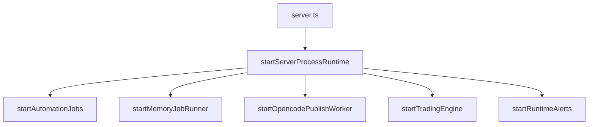
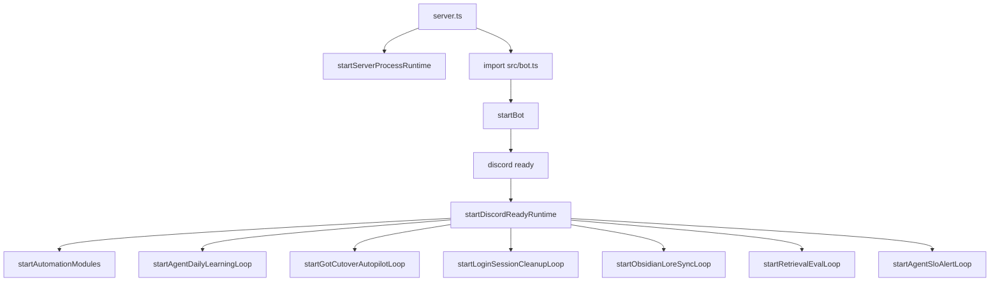
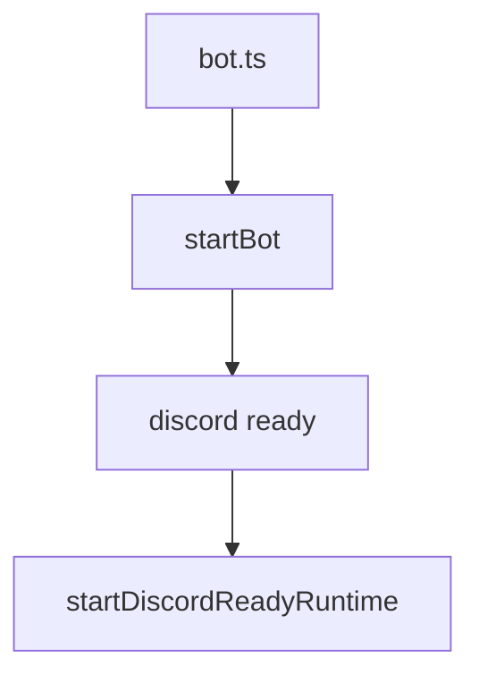

# Architecture Index

## Boundary Note

This repository uses internal collaboration and runtime labels for planning, routing, and worker execution.
Legacy labels such as OpenCode, OpenDev, NemoClaw, OpenJarvis, and Local Orchestrator are repository-local names that have been migrated to neutral equivalents (Implement, Architect, Review, Operate, Coordinate).
They are not proof that external frameworks with similar names are installed or automatically integrated in this repository runtime.
Actual runtime integration must be confirmed through configured providers, registered actions, worker endpoints, and runtime status endpoints.

Canonical naming and runtime surface source of truth:

- `docs/RUNTIME_NAME_AND_SURFACE_MATRIX.md`
- `docs/ROLE_RENAME_MAP.md`

## Purpose

This document is the external analysis entrypoint for the backend repository.
It provides a stable map of runtime flow, domain boundaries, and data boundaries.

Document Role:

- Canonical for repository runtime structure and service/data boundary map.
- Use this index to locate code surfaces before changing routes, runtime ownership, or persistence boundaries.
- Directional priority still comes from [docs/planning/UNIFIED_ROADMAP_SOCIAL_OPS_2026Q2.md](docs/planning/UNIFIED_ROADMAP_SOCIAL_OPS_2026Q2.md).

Primary operations entrypoint:

- `docs/RUNBOOK_MUEL_PLATFORM.md` (unified DevOps/SRE runbook)
- `docs/planning/UNIFIED_ROADMAP_SOCIAL_OPS_2026Q2.md` (social mapping + autonomous ops canonical roadmap)
- `docs/planning/EXECUTION_BOARD.md` (milestone-bound now/next/later execution board)
- `docs/OPERATOR_SOP_DECISION_TABLE.md` (who/when/threshold/action decision matrix)
- `docs/HARNESS_ENGINEERING_PLAYBOOK.md` (model runtime harness design)
- `docs/HARNESS_RELEASE_GATES.md` (go/no-go gates for harness quality)
- `docs/ONCALL_INCIDENT_TEMPLATE.md` (incident timeline template)
- `docs/ONCALL_COMMS_PLAYBOOK.md` (incident communications)
- `docs/POSTMORTEM_TEMPLATE.md` (post-incident review)
- `docs/planning/MULTI_AGENT_NODE_EXTRACTION_TARGET_STATE.md` (multiAgentService core split target state)
- `docs/planning/mcp/MCP_TOOL_SPEC.md` (MCP tool contract)
- `docs/planning/mcp/MCP_ROLLOUT_1W.md` (MCP rollout plan)
- `docs/planning/mcp/LIGHTWORKER_SPLIT_ARCH.md` (core-worker split)
- `docs/LANGGRAPH_STATEGRAPH_BLUEPRINT.md` (LangGraph migration-ready state graph blueprint)
- `docs/GOT_LANGGRAPH_EXECUTION_PLAN.md` (GoT reasoning + LangGraph execution rollout plan)
- `docs/planning/LOCAL_COLLAB_AGENT_WORKFLOW.md` (local IDE lead+consult agent workflow)

## Runtime Entrypoints

- `server.ts`: HTTP API process bootstrap.
- `bot.ts`: Discord bot-only process bootstrap.
- `src/app.ts`: Express middleware and route composition.
- `src/bot.ts`: Discord command/event runtime and bot orchestration.
- `src/routes/bot.ts` + `src/routes/botAgentRoutes.ts`: bot control-plane routes split into core and agent composition boundary.
- `src/routes/bot-agent/*.ts`: agent domain routes (`core`, `runtime`, `got`, `qualityPrivacy`, `governance`, `tools`, `memory`, `learning`) registered by composer.
- `src/services/runtimeBootstrap.ts`: centralized startup boundaries for server process runtime and Discord-ready runtime.
- `src/services/superAgentService.ts`: structured super-agent facade that normalizes a supervisor task envelope, emits schema-aligned route output, and delegates execution to the existing session runtime.
- `src/services/entityNervousSystem.ts`: feedback-circuit integrator that connects session completion, reward trend, and sprint retro outputs back into long-term memory, behavior adjustment, and self-notes.

## Local IDE Collaboration Surface

This repository now defines a customization-level local collaboration surface for IDE work:

- `.github/agents/local-orchestrator.agent.md`
- `.github/prompts/local-collab-route.prompt.md`
- `.github/prompts/local-collab-consult.prompt.md`
- `.github/prompts/local-collab-synthesize.prompt.md`
- `.github/instructions/multi-agent-routing.instructions.md`

Role of this surface:

- choose a lead agent for local IDE work
- attach targeted consult agents without forcing a full delivery pipeline
- standardize `lead_agent`, `consult_agents`, `required_gates`, `handoff`, `escalation`, `next_action`

Boundary note:

- this layer is control-plane guidance for local development, not a replacement for `src/services/multiAgentService.ts`
- runtime handoff normalization still follows current code contracts such as `ActionHandoff` in `src/services/skills/actions/types.ts`

## Customization vs Runtime Boundary

The repository currently uses the same role names across two different layers:

- customization/control-plane: `.github/agents/*`, `.github/prompts/local-collab-*.prompt.md`, `.github/instructions/multi-agent-routing.instructions.md`
- runtime execution: `src/services/superAgentService.ts`, `src/services/skills/actions/agentCollab.ts`, `src/services/skills/actions/registry.ts`, `src/services/skills/actionRunner.ts`, advisory role workers

Interpretation rule:

- role names such as Implement, Architect, Review, Operate, and Coordinate (and their legacy aliases OpenCode, OpenDev, NemoClaw, OpenJarvis, Local Orchestrator) are repository-local collaboration roles
- they do not by themselves prove that an upstream open-source system is installed, embedded, or directly executed by this repository
- runtime-backed behavior exists only where a registered action, worker URL, or HTTP/MCP transport is present in code and environment

Current runtime-backed collaboration surfaces:

- `coordinate.route` (legacy: `local.orchestrator.route`)
- `coordinate.all` (legacy: `local.orchestrator.all`)
- `architect.plan` (legacy: `opendev.plan`)
- `review.review` (legacy: `nemoclaw.review`)
- `operate.ops` (legacy: `openjarvis.ops`)
- `implement.execute` (legacy: `opencode.execute`)
- `tools.run.cli`

Current local tool/runtime facts:

- local Ollama provider usage is supported in `src/services/llmClient.ts`
- HTTP/MCP-style delegated workers are supported via `src/services/mcpWorkerClient.ts` and `scripts/agent-role-worker.ts`
- a first narrow local CLI tool slice exists via `src/services/tools/*` and `GET /api/bot/agent/tools/status`
- general-purpose discovery and wrapping of arbitrary local OSS CLIs/servers is not yet a first-class runtime layer in this repository

Planning note:

- keep collaboration-role documents focused on routing and handoff contracts
- keep runtime and operator truth in service code plus runtime status endpoints
- track future local external tool integration separately in `docs/planning/LOCAL_TOOL_ADAPTER_ARCHITECTURE.md`
- use `docs/RUNTIME_NAME_AND_SURFACE_MATRIX.md` when a role name could be confused with an external OSS/runtime/model name

## Runtime Loop Inventory (Current Code)

Canonical runtime loop snapshot:

- `src/services/runtimeSchedulerPolicyService.ts` (`getRuntimeSchedulerPolicySnapshot`)
- Operator API surface: `GET /api/bot/agent/runtime/scheduler-policy`

Startup phase `service-init`:

- `memory-job-runner` (`src/services/memoryJobRunner.ts`)
- `opencode-publish-worker` (`src/services/opencodePublishWorker.ts`)
- `trading-engine` (`src/services/tradingEngine.ts`)
- `runtime-alerts` (`src/services/runtimeAlertService.ts`)

Startup phase `discord-ready`:

- `automation-modules` (`src/services/automationBot.ts`)
- `agent-daily-learning` (`src/services/agentOpsService.ts`)
- `got-cutover-autopilot` (`src/services/agentOpsService.ts`)
- `login-session-cleanup` when owner=`app` (`src/discord/auth.ts`)
- `obsidian-sync-loop` (`src/services/obsidianLoreSyncService.ts`)
- `retrieval-eval-loop` (`src/services/retrievalEvalLoopService.ts`)
- `agent-slo-alert-loop` (`src/services/agentSloService.ts`)

Startup phase `database`:

- `supabase-maintenance-cron` (`src/services/supabaseExtensionOpsService.ts`)
- `login-session-cleanup` when owner=`db` (`src/discord/auth.ts` + pg_cron)

Terminology rule:

- `startup` is when loop starts (`service-init`, `discord-ready`, `database`).
- `owner` is execution owner (`app`, `db`).
- During incident triage, compare both fields; owner mismatch and startup mismatch are different failure classes.

## LLM Provider Resolution Rules (Code-Aligned)

Canonical source:

- `src/services/llmClient.ts`

Hugging Face token alias order:

1. `HF_TOKEN`
2. `HF_API_KEY`
3. `HUGGINGFACE_API_KEY`

Provider alias normalization:

- `hf` -> `huggingface`
- `claude` -> `anthropic`
- `local` -> `ollama`

Base provider resolution (when request provider is omitted):

1. `AI_PROVIDER` preferred value if configured
2. `LLM_PROVIDER_BASE_ORDER` if configured
3. default fallback priority: `openai` -> `anthropic` -> `gemini` -> `huggingface` -> `openclaw` -> `ollama`

Fallback chain composition:

1. selected provider
2. action policy matches (`LLM_PROVIDER_POLICY_ACTIONS`)
3. `LLM_PROVIDER_FALLBACK_CHAIN`
4. base resolver provider
5. `LLM_PROVIDER_AUTOMATIC_FALLBACK_ORDER` or default automatic order (`openclaw`, `openai`, `anthropic`, `gemini`, `huggingface`, `ollama`) when `LLM_PROVIDER_AUTOMATIC_FALLBACK_ENABLED=true`

Guardrails:

- keep only configured providers
- dedupe chain
- cap attempts by `LLM_PROVIDER_MAX_ATTEMPTS`
- for HF experiment arm, `LLM_EXPERIMENT_FAIL_OPEN=false` disables non-HF fallback

## Bootstrap Profiles and Startup DAG

Canonical source:

- `server.ts`
- `src/services/runtimeBootstrap.ts`
- `src/bot.ts`

Profile A: server-only (`START_BOT=false`)



Profile B: unified server+bot (`START_BOT=true` and token present)



Profile C: bot-only (`bot.ts` entry)



Profile note:

- `config/env/local.profile.env`, `config/env/local-first-hybrid.profile.env`, `config/env/production.profile.env` tune OpenJarvis routing/worker strictness and LLM provider preference only.
- Runtime startup DAG is controlled by entrypoint + `START_BOT` + Discord token presence.

## Request Flow (HTTP)

1. `server.ts` loads env and monitoring.
2. `createApp()` in `src/app.ts` composes middleware.
3. Global middleware: CORS, JSON body parser, cookie parser, user attach, CSRF guard.
4. Domain routers mounted under `/api/*` plus health and readiness endpoints.
5. Fallback returns `404 NOT_FOUND`.

## Domain Routers

- `/api/auth`: login, callback, session endpoints.
- `/api/research`: preset retrieval and management.
- `/api/fred`: economic data endpoints.
- `/api/quant`: quant panel contract endpoint.
- `/api/bot`: runtime status, automation controls, agent operations.
- Agent super-facade endpoints under `/api/bot/agent/super/*`: structured recommendation and session start over the existing session runtime.
- `/api/benchmark`: benchmark event ingest and summary.
- `/api/trades`: trade query and write APIs.
- `/api/trading`: strategy/runtime/position control APIs.
- `/health`, `/ready`, `/api/status`: operational health surface.

## Core Service Domains

- Auth and identity: session parse, cookie/token validation, admin allowlist.
- Automation runtime: scheduled jobs and worker health.
- Agent runtime: multi-agent orchestration, policy, memory/session persistence.
- Trading runtime: strategy, engine loop, distributed lock protections.
- Integrations: Supabase, Discord, LLM providers, external market/macro sources.

## Data Boundaries

- Canonical schema bootstrap: `docs/SUPABASE_SCHEMA.sql`.
- Schema usage map (generated): `docs/SCHEMA_SERVICE_MAP.md`.
- Table families:
- User/authn/authz (`users`, `user_roles`, `settings`).
- News and automation telemetry (`sources`, `alerts`, `logs`, `news_sentiment`, `youtube_log`).
- Trading (`trading_strategy`, `trades`, related control/runtime tables).
- Agent runtime (`agent_sessions`, `agent_steps`, policy/memory-related tables when configured).
- Infra primitives (`distributed_locks`, rate-limit RPC backing objects).

## Generated Analysis Artifacts

- Route inventory: `docs/ROUTES_INVENTORY.md`
- Dependency graph: `docs/DEPENDENCY_GRAPH.md`
- Schema-service usage map: `docs/SCHEMA_SERVICE_MAP.md`

Regeneration command:

```bash
npm run docs:build
```

## Change Control

When modifying route registration, core service boundaries, or persistence strategy:

1. Update this index when structure meaning changes.
2. Run `npm run docs:build`.
3. Add an entry in `docs/CHANGELOG-ARCH.md`.
4. Run `npm run routes:check:agent` to verify duplicated/misplaced agent endpoints across route modules.
