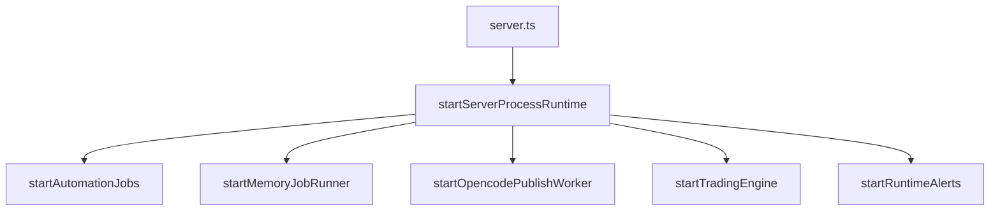
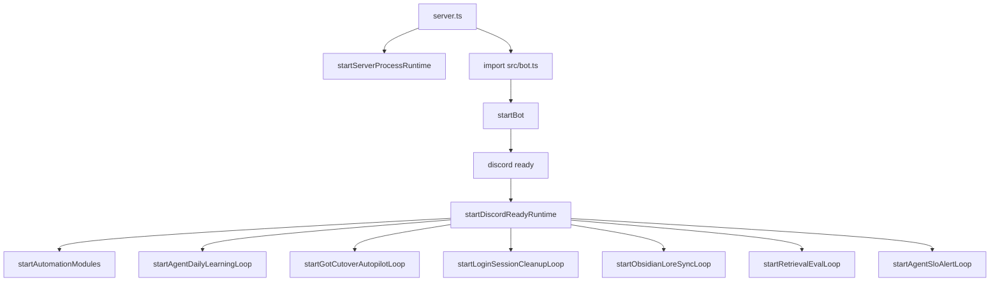
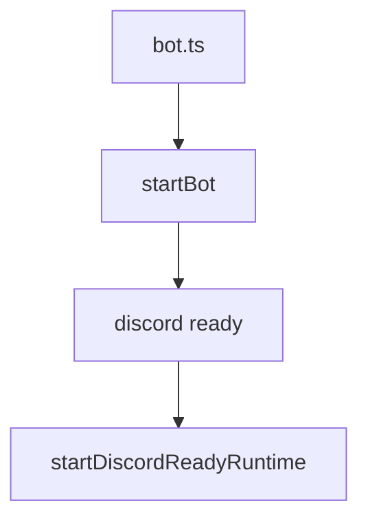

# Architecture Index

## Purpose

This document is the external analysis entrypoint for the backend repository.
It provides a stable map of runtime flow, domain boundaries, and data boundaries.

Document Role:

- Canonical for repository runtime structure and service/data boundary map.
- Use this index to locate code surfaces before changing routes, runtime ownership, or persistence boundaries.
- Directional priority still comes from [docs/planning/UNIFIED_ROADMAP_SOCIAL_OPS_2026Q2.md](docs/planning/UNIFIED_ROADMAP_SOCIAL_OPS_2026Q2.md).

Primary operations entrypoint:

- `docs/RUNBOOK_MUEL_PLATFORM.md` (unified DevOps/SRE runbook)
- `docs/planning/UNIFIED_ROADMAP_SOCIAL_OPS_2026Q2.md` (social mapping + autonomous ops canonical roadmap)
- `docs/planning/EXECUTION_BOARD.md` (milestone-bound now/next/later execution board)
- `docs/OPERATOR_SOP_DECISION_TABLE.md` (who/when/threshold/action decision matrix)
- `docs/HARNESS_ENGINEERING_PLAYBOOK.md` (model runtime harness design)
- `docs/HARNESS_RELEASE_GATES.md` (go/no-go gates for harness quality)
- `docs/ONCALL_INCIDENT_TEMPLATE.md` (incident timeline template)
- `docs/ONCALL_COMMS_PLAYBOOK.md` (incident communications)
- `docs/POSTMORTEM_TEMPLATE.md` (post-incident review)
- `docs/planning/MULTI_AGENT_NODE_EXTRACTION_TARGET_STATE.md` (multiAgentService core split target state)
- `docs/planning/mcp/MCP_TOOL_SPEC.md` (MCP tool contract)
- `docs/planning/mcp/MCP_ROLLOUT_1W.md` (MCP rollout plan)
- `docs/planning/mcp/LIGHTWORKER_SPLIT_ARCH.md` (core-worker split)
- `docs/LANGGRAPH_STATEGRAPH_BLUEPRINT.md` (LangGraph migration-ready state graph blueprint)
- `docs/GOT_LANGGRAPH_EXECUTION_PLAN.md` (GoT reasoning + LangGraph execution rollout plan)

## Runtime Entrypoints

- `server.ts`: HTTP API process bootstrap.
- `bot.ts`: Discord bot-only process bootstrap.
- `src/app.ts`: Express middleware and route composition.
- `src/bot.ts`: Discord command/event runtime and bot orchestration.
- `src/routes/bot.ts` + `src/routes/botAgentRoutes.ts`: bot control-plane routes split into core and agent composition boundary.
- `src/routes/bot-agent/*.ts`: agent domain routes (`core`, `runtime`, `got`, `qualityPrivacy`, `governance`, `memory`, `learning`) registered by composer.
- `src/services/runtimeBootstrap.ts`: centralized startup boundaries for server process runtime and Discord-ready runtime.

## Runtime Loop Inventory (Current Code)

Canonical runtime loop snapshot:

- `src/services/runtimeSchedulerPolicyService.ts` (`getRuntimeSchedulerPolicySnapshot`)
- Operator API surface: `GET /api/bot/agent/runtime/scheduler-policy`

Startup phase `service-init`:

- `memory-job-runner` (`src/services/memoryJobRunner.ts`)
- `opencode-publish-worker` (`src/services/opencodePublishWorker.ts`)
- `trading-engine` (`src/services/tradingEngine.ts`)
- `runtime-alerts` (`src/services/runtimeAlertService.ts`)

Startup phase `discord-ready`:

- `automation-modules` (`src/services/automationBot.ts`)
- `agent-daily-learning` (`src/services/agentOpsService.ts`)
- `got-cutover-autopilot` (`src/services/agentOpsService.ts`)
- `login-session-cleanup` when owner=`app` (`src/discord/auth.ts`)
- `obsidian-sync-loop` (`src/services/obsidianLoreSyncService.ts`)
- `retrieval-eval-loop` (`src/services/retrievalEvalLoopService.ts`)
- `agent-slo-alert-loop` (`src/services/agentSloService.ts`)

Startup phase `database`:

- `supabase-maintenance-cron` (`src/services/supabaseExtensionOpsService.ts`)
- `login-session-cleanup` when owner=`db` (`src/discord/auth.ts` + pg_cron)

Terminology rule:

- `startup` is when loop starts (`service-init`, `discord-ready`, `database`).
- `owner` is execution owner (`app`, `db`).
- During incident triage, compare both fields; owner mismatch and startup mismatch are different failure classes.

## LLM Provider Resolution Rules (Code-Aligned)

Canonical source:

- `src/services/llmClient.ts`

Hugging Face token alias order:

1. `HF_TOKEN`
2. `HF_API_KEY`
3. `HUGGINGFACE_API_KEY`

Provider alias normalization:

- `hf` -> `huggingface`
- `claude` -> `anthropic`
- `local` -> `ollama`

Base provider resolution (when request provider is omitted):

1. `AI_PROVIDER` preferred value if configured
2. fallback priority: `openai` -> `anthropic` -> `gemini` -> `huggingface` -> `openclaw` -> `ollama`

Fallback chain composition:

1. selected provider
2. action policy matches (`LLM_PROVIDER_POLICY_ACTIONS`)
3. `LLM_PROVIDER_FALLBACK_CHAIN`
4. base resolver provider
5. automatic fallback order (`openclaw`, `openai`, `anthropic`, `gemini`, `huggingface`, `ollama`) when `LLM_PROVIDER_AUTOMATIC_FALLBACK_ENABLED=true`

Guardrails:

- keep only configured providers
- dedupe chain
- cap attempts by `LLM_PROVIDER_MAX_ATTEMPTS`
- for HF experiment arm, `LLM_EXPERIMENT_FAIL_OPEN=false` disables non-HF fallback

## Bootstrap Profiles and Startup DAG

Canonical source:

- `server.ts`
- `src/services/runtimeBootstrap.ts`
- `src/bot.ts`

Profile A: server-only (`START_BOT=false`)



Profile B: unified server+bot (`START_BOT=true` and token present)



Profile C: bot-only (`bot.ts` entry)



Profile note:

- `config/env/local.profile.env`, `config/env/production.profile.env` tune OpenJarvis routing/worker strictness only.
- Runtime startup DAG is controlled by entrypoint + `START_BOT` + Discord token presence.

## Request Flow (HTTP)

1. `server.ts` loads env and monitoring.
2. `createApp()` in `src/app.ts` composes middleware.
3. Global middleware: CORS, JSON body parser, cookie parser, user attach, CSRF guard.
4. Domain routers mounted under `/api/*` plus health and readiness endpoints.
5. Fallback returns `404 NOT_FOUND`.

## Domain Routers

- `/api/auth`: login, callback, session endpoints.
- `/api/research`: preset retrieval and management.
- `/api/fred`: economic data endpoints.
- `/api/quant`: quant panel contract endpoint.
- `/api/bot`: runtime status, automation controls, agent operations.
- `/api/benchmark`: benchmark event ingest and summary.
- `/api/trades`: trade query and write APIs.
- `/api/trading`: strategy/runtime/position control APIs.
- `/health`, `/ready`, `/api/status`: operational health surface.

## Core Service Domains

- Auth and identity: session parse, cookie/token validation, admin allowlist.
- Automation runtime: scheduled jobs and worker health.
- Agent runtime: multi-agent orchestration, policy, memory/session persistence.
- Trading runtime: strategy, engine loop, distributed lock protections.
- Integrations: Supabase, Discord, LLM providers, external market/macro sources.

## Data Boundaries

- Canonical schema bootstrap: `docs/SUPABASE_SCHEMA.sql`.
- Schema usage map (generated): `docs/SCHEMA_SERVICE_MAP.md`.
- Table families:
- User/authn/authz (`users`, `user_roles`, `settings`).
- News and automation telemetry (`sources`, `alerts`, `logs`, `news_sentiment`, `youtube_log`).
- Trading (`trading_strategy`, `trades`, related control/runtime tables).
- Agent runtime (`agent_sessions`, `agent_steps`, policy/memory-related tables when configured).
- Infra primitives (`distributed_locks`, rate-limit RPC backing objects).

## Generated Analysis Artifacts

- Route inventory: `docs/ROUTES_INVENTORY.md`
- Dependency graph: `docs/DEPENDENCY_GRAPH.md`
- Schema-service usage map: `docs/SCHEMA_SERVICE_MAP.md`

Regeneration command:

```bash
npm run docs:build
```

## Change Control

When modifying route registration, core service boundaries, or persistence strategy:

1. Update this index when structure meaning changes.
2. Run `npm run docs:build`.
3. Add an entry in `docs/CHANGELOG-ARCH.md`.
4. Run `npm run routes:check:agent` to verify duplicated/misplaced agent endpoints across route modules.
