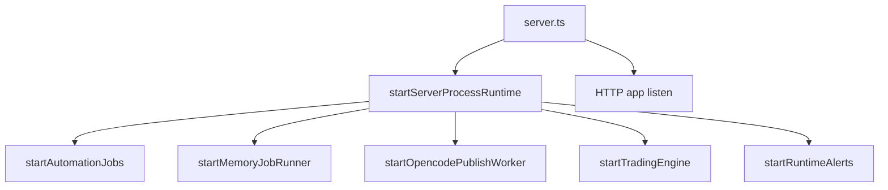
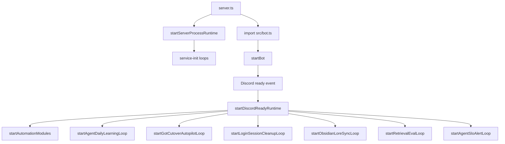
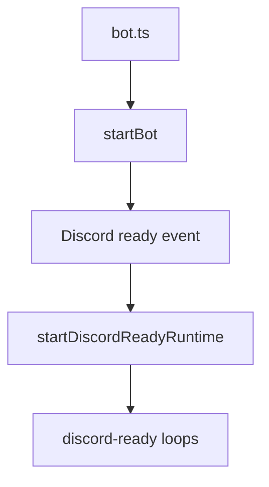

# Muel Platform Unified Runbook

## Naming And Runtime Boundary

Operational documents in this repository may reference legacy internal labels that were used for local routing and worker surfaces.
Those labels do not describe external product installation status.
When this runbook refers to executable runtime surfaces, it means concrete integrations such as Ollama, local CLI tools, MCP servers, local workers, remote workers, and configured model providers.

Canonical naming and runtime surface source of truth:

- `docs/RUNTIME_NAME_AND_SURFACE_MATRIX.md`
- `docs/ROLE_RENAME_MAP.md`

This is the single operational runbook for the Muel platform across Discord, Render, Supabase, Vercel, and Obsidian sync.

Use this document as the first entrypoint for DevOps/SRE operations.
Detailed domain docs are linked where needed, but this runbook is designed to be executable end-to-end.

Document Role:

- Canonical for platform-wide operational procedure.
- Read first for incident handling, deployment verification, and operator execution.
- Companion documents may add detail, but they must not override this runbook's operating procedure.

> Role naming: `docs/ROLE_RENAME_MAP.md` | Runtime surface truth: `docs/RUNTIME_NAME_AND_SURFACE_MATRIX.md`

## 0) System Scope

Platform components:

- Render Web Service: backend API + Discord bot + automation jobs
- Supabase: persistence for auth, operations, memory, trading, and telemetry
- Vercel: frontend UI
- Local/worker machine: Obsidian vault sync to `guild_lore_docs`

Primary goals:

- Keep Discord bot and API continuously available
- Preserve long-term guild memory with safe fallback (Supabase-first)
- Allow controlled operations through authenticated admin endpoints
- Maintain clear recovery and incident procedures

## 1) Ownership and SLO

Suggested ownership model:

- Service owner: backend runtime and deployment
- Data owner: Supabase schema and data quality
- Frontend owner: Vercel app and OAuth UX
- On-call: first response, mitigation, escalation

Single-operator mode (current):

- This platform can be operated by one developer.
- Primary risk framing is operator context overload and decision latency, not cross-team communication.
- Mitigation baseline:
  - Keep runbooks and changelog synchronized on every architecture-significant change.
  - Keep go/no-go gates and operational thresholds explicit and versioned.
  - Prefer automation with fail-closed defaults for high-impact operations.

Suggested baseline SLO (adjust as needed):

- API availability: 99.5%
- Discord bot readiness: 99.0%
- Obsidian sync freshness: within 60 minutes

## 2) Source of Truth

Open these first when verifying behavior:

- Runtime architecture index: `docs/ARCHITECTURE_INDEX.md`
- Unified roadmap (canonical): `docs/planning/UNIFIED_ROADMAP_SOCIAL_OPS_2026Q2.md`
- 24/7 runtime ops: `docs/OPERATIONS_24_7.md`
- Operator decision matrix: `docs/OPERATOR_SOP_DECISION_TABLE.md`
- Platform document control tower: `docs/planning/PLATFORM_CONTROL_TOWER.md`
- Harness playbook: `docs/HARNESS_ENGINEERING_PLAYBOOK.md`
- Harness manifest template: `docs/HARNESS_MANIFEST.example.yaml`
- Harness release gates: `docs/HARNESS_RELEASE_GATES.md`
- Frontend contract and CORS/auth details: `docs/FRONTEND_INTEGRATION.md`
- Supabase schema: `docs/SUPABASE_SCHEMA.sql`
- Obsidian sync operations: `docs/OBSIDIAN_SUPABASE_SYNC.md`
- MCP tool spec and rollout: `docs/planning/mcp/MCP_TOOL_SPEC.md`, `docs/planning/mcp/MCP_ROLLOUT_1W.md`
- Lightweight worker split: `docs/planning/mcp/LIGHTWORKER_SPLIT_ARCH.md`
- Progressive autonomy 30-day checklist: `docs/archive/PROGRESSIVE_AUTONOMY_30D_CHECKLIST.md` (ARCHIVED)
- Go/No-Go gate template: `docs/planning/GO_NO_GO_GATE_TEMPLATE.md`
- Autonomy contract schemas: `docs/planning/AUTONOMY_CONTRACT_SCHEMAS.json`
- Local-first hybrid autonomy: `docs/planning/LOCAL_FIRST_HYBRID_AUTONOMY.md`
- Local external tool adapter architecture: `docs/planning/LOCAL_TOOL_ADAPTER_ARCHITECTURE.md`
- GCP opencode worker VM deploy: `docs/planning/GCP_OPENCODE_WORKER_VM_DEPLOY.md`
- Remote-only autonomy implementation: `docs/planning/REMOTE_ONLY_AUTONOMY_IMPLEMENTATION.md`
- Generated route map: `docs/ROUTES_INVENTORY.md`
- Schema-service map: `docs/SCHEMA_SERVICE_MAP.md`

Runtime/control-plane verification baseline:

- Treat `GET /api/bot/agent/runtime/scheduler-policy` as the canonical operator snapshot for loop ownership and startup phase.
- Use `GET /api/bot/agent/runtime/loops` and `GET /api/bot/agent/runtime/unattended-health` before deciding restart, rollback, or workload freeze.
- Use `GET /api/bot/agent/runtime/worker-approval-gates?guildId=<id>&recentLimit=5` when validating A-003 gate -> approval -> model fallback state for a specific guild.
- Use `GET /api/bot/agent/actions/catalog` and `GET /api/bot/agent/runtime/role-workers` before assuming that a named role is callable in the current deployment.
- Distinguish startup phase (`service-init`, `discord-ready`, `database`) from execution ownership (`app`, `db`) during incident triage; not every missing Discord-ready loop is a platform-wide outage.

## 2.1) Current Progress Snapshot (2026-03-15)

This snapshot captures what is already running in production-oriented flow.

- Guild onboarding automation:
  - New guild join can auto-bootstrap Obsidian knowledge tree.
  - Optional first ops-cycle can run immediately after bootstrap.
- Obsidian sync model:
  - Sync moved from fixed 3-document mode to manifest-driven recursive collection.
  - All-guild discovery mode is supported for periodic loops.
- Continuous context ingestion:
  - Discord category/channel topology snapshots are persisted to guild knowledge tree.
  - Channel/user activity telemetry snapshots are persisted periodically.
  - Reaction reward snapshots (thumbs-up/thumbs-down) are persisted periodically.
- User feedback loop:
  - User-facing response footer prompt can be enabled for lightweight quality signal.

- Social graph memory plane:
  - `community_interaction_events`, `community_relationship_edges`, `community_actor_profiles` are active schema targets.
  - reply/mention/co_presence/reaction signals are ingested and aggregated.
  - requester-aware social hints are merged into memory hint pipeline.
  - user/guild forget scope includes social graph data.

Operational meaning:

- Current stage is no longer static memory sync.
- Current stage is an autonomous guild-context operating loop with safety gates.

## 2.2) Document Governance (Roadmap/Runbook/Backlog Sync)

For roadmap and operations coherence, use this order:

1. `docs/planning/UNIFIED_ROADMAP_SOCIAL_OPS_2026Q2.md`: direction, priorities, milestone IDs
2. `docs/planning/EXECUTION_BOARD.md`: current state (Now/Next/Later)
3. `docs/planning/SPRINT_BACKLOG_MEMORY_AGENT.md`: task-level implementation units
4. `docs/RUNBOOK_MUEL_PLATFORM.md`: operational execution procedures

Sync rule:

- If roadmap priority changes, update the four documents above in the same change set.

## 3) Day 0 Provisioning Checklist

### 3.1 Supabase

1. Apply `docs/SUPABASE_SCHEMA.sql` in SQL editor.
2. Verify critical tables exist:
   - `users`, `user_roles`, `discord_login_sessions`
   - `agent_sessions`, `agent_steps`
   - `memory_items`, `memory_sources`, `memory_jobs`
   - `guild_lore_docs`, `api_rate_limits`, `distributed_locks`
3. Confirm service-role credentials are available to backend.

### 3.2 Render (backend + bot)

1. Configure build/start commands:
   - Build: `npm ci; npm run build`
   - Start: `npm run start`
2. Set required env values:

    - `NODE_ENV=production`
    - `START_BOT=true`
    - `START_AUTOMATION_JOBS=true`
    - `DISCORD_TOKEN` (or `DISCORD_BOT_TOKEN`)
    - `JWT_SECRET`
    - `SUPABASE_URL`
    - `SUPABASE_SERVICE_ROLE_KEY` (or `SUPABASE_KEY`)
    - LLM keys (`AI_PROVIDER` + provider key)
    - `OPENJARVIS_REQUIRE_OPENCODE_WORKER=true`
    - `ACTION_MCP_STRICT_ROUTING=true`
    - `MCP_OPENCODE_WORKER_URL=https://34.56.232.61.sslip.io` (temporary TLS endpoint; replace with custom domain later)
    - `MCP_OPENCODE_TOOL_NAME=opencode.run`

3. Set web integration env values:
   - `PUBLIC_BASE_URL=https://<render-domain>`
   - `CORS_ALLOWLIST` (include Vercel domain)
   - Discord OAuth keys and callback settings

### 3.3 Vercel (frontend)

1. Set `VITE_API_BASE_URL` to Render backend URL.
2. Ensure cookie auth and CSRF contract is implemented.
3. Validate popup OAuth flow with backend callback endpoint.

### 3.4 Obsidian Sync Worker (no Render disk)

1. On local or worker host, configure:
   - `OBSIDIAN_SYNC_VAULT_PATH`
   - `SUPABASE_URL`
   - `SUPABASE_SERVICE_ROLE_KEY` (or `SUPABASE_KEY`)
2. Run:
   - `npm run sync:obsidian-lore:dry`
   - `npm run sync:obsidian-lore`
3. Schedule recurring sync (Windows Task Scheduler recommended).

### 3.5 Server-Only Autonomous Mode (local PC off)

목표: 로컬 PC가 꺼져 있어도 Discord Bot + Render + LiteLLM + Obsidian Headless 경로만으로 서비스 지속.

1. Provider를 프록시 단일 경로로 고정:

- `AI_PROVIDER=openclaw`
- `OPENCLAW_BASE_URL=https://<litellm-proxy-endpoint>`
- `OPENCLAW_API_KEY=<secret>`

1. Obsidian remote-mcp 기반 경로 활성화:

- `OBSIDIAN_REMOTE_MCP_ENABLED=true`
- `OBSIDIAN_REMOTE_MCP_URL=http://<gcp-vm>:8850`
- `OBSIDIAN_REMOTE_MCP_TOKEN=<secret>`
- `OBSIDIAN_VAULT_NAME=<vault-name>`
- `OBSIDIAN_ADAPTER_STRICT=true`
- `OBSIDIAN_ADAPTER_ORDER=remote-mcp,script-cli`
- `OBSIDIAN_ADAPTER_ORDER_READ_LORE=remote-mcp,script-cli`
- `OBSIDIAN_ADAPTER_ORDER_SEARCH_VAULT=remote-mcp`
- `OBSIDIAN_ADAPTER_ORDER_READ_FILE=remote-mcp`
- `OBSIDIAN_ADAPTER_ORDER_GRAPH_METADATA=remote-mcp`
- `OBSIDIAN_ADAPTER_ORDER_WRITE_NOTE=remote-mcp,script-cli`

1. OpenJarvis 원격 실행 강제:

- `OPENJARVIS_REQUIRE_OPENCODE_WORKER=true`
- `MCP_OPENCODE_WORKER_URL=<remote-worker-url>`
- `MCP_OPENCODE_TOOL_NAME=opencode.run`
- `ACTION_MCP_STRICT_ROUTING=true`

1. 쓰기 전략 분리:

- 문서/지식 업데이트는 `memory_items`, `guild_lore_docs` 등 DB 경로를 주 경로로 사용
- 파일 직접 쓰기는 `script-cli` 또는 DB 비동기 경로로만 운영 (`local-fs` 미사용)

1. 배포 후 필수 검증:

- `GET /api/bot/agent/obsidian/runtime` 확인
- `GET /ready` 확인
- `memory_retrieval_logs`, `agent_tot_candidate_pairs` 누적 확인

### 3.6 Env Profile Switching (Local vs Production)

목표: `.env` 수동 편집 실수를 줄이고 로컬/운영 프로필 전환을 재현 가능하게 유지한다.

프로필 정의 파일:

- `config/env/local.profile.env`
- `config/env/local-first-hybrid.profile.env`
- `config/env/production.profile.env`

적용 명령:

- 로컬 개발형 적용: `npm run env:profile:local`
- 로컬 추론 우선형 적용: `npm run env:profile:local-first-hybrid`
- 운영형 적용: `npm run env:profile:production`
- 사전 미리보기(dry-run): `npm run env:profile:local:dry`
- 사전 미리보기(dry-run): `npm run env:profile:local-first-hybrid:dry`
- 사전 미리보기(dry-run): `npm run env:profile:production:dry`

가드레일:

- 적용 스크립트는 기존 `.env`를 `.env.profile-backup`으로 백업한다.
- 운영형 적용 후에는 `MCP_OPENCODE_WORKER_URL`이 실제 원격 워커 URL인지 별도 확인한다.
- 적용 직후 `npm run env:check`와 `npm run openjarvis:autonomy:run:dry`로 검증한다.
- local-first hybrid 적용 직후에는 `npm run env:check:local-hybrid`로 Ollama/worker 공존 readiness를 추가 확인한다.
- 로컬 worker를 사용하는 경우 `npm run worker:opencode:local`을 먼저 실행한 뒤 hybrid 검증을 수행한다.
- 원격 worker가 GCP VM일 경우 외부 IP는 정적 IP로 예약하고, `sslip.io`는 임시 도메인으로만 사용한다.

### 3.7 Bootstrap Profiles and Startup DAG

목표: 부팅 경로를 프로파일별로 고정해 장애 triage 시 "무엇이 시작되어야 하는지"를 즉시 판별한다.

공통 규칙:

- `server.ts`는 항상 `startServerProcessRuntime()`를 먼저 실행한다.
- `START_BOT=true`이고 토큰이 있을 때만 `src/bot.ts`가 로드되고 Discord ready 워크로드가 시작된다.
- `config/env/local.profile.env`, `config/env/local-first-hybrid.profile.env`, `config/env/production.profile.env`는 OpenJarvis 라우팅/worker 강제 정책과 LLM provider 우선순위만 바꾸며, runtime bootstrap DAG 자체는 바꾸지 않는다.

Profile A: server-only (`START_BOT=false`)



Profile B: unified server+bot (`START_BOT=true` and token present)



Profile C: bot-only process (`bot.ts` entry)



## 4) Day 1 Go-Live Verification

Run in order:

1. `npm run env:check` (preflight)
2. `GET /health` returns healthy or expected degraded details
3. `GET /ready` confirms runtime readiness
4. OAuth login from frontend works
5. `GET /api/auth/me` returns session + CSRF metadata
6. Admin-only endpoint check (`/api/trading/strategy` or `/api/bot/status`) matches expected permission
7. Obsidian sync dry run and real run complete without fatal errors
8. `guild_lore_docs` has updated rows for active guilds

## 5) Daily Operations (Day 2)

### 5.0 Runtime Artifacts (Role and VCS Policy)

Runtime artifact files are operational outputs, not source-of-truth code/docs. They are useful for
diagnostics, replay, and local fallback, but should not be committed as routine code changes.

Primary files:

- `.runtime/worker-approvals.json`
  - Role: file-backend fallback store for worker approval queue/state.
  - Producer: `src/services/workerGeneration/workerApprovalStore.ts`
  - Notes: mutable runtime state; DB backend is preferred in production.
- `tmp/autonomy/openjarvis-unattended-last-run.json`
  - Role: latest unattended workflow summary pointer.
  - Producer: `scripts/run-openjarvis-unattended.mjs`
- `tmp/autonomy/workflow-sessions/*.json`
  - Role: per-run state transitions and handoff evidence timeline.
  - Producer: `scripts/openjarvis-workflow-state.mjs`

VCS policy:

- These files are gitignored by default.
- Default policy: runtime artifacts are not tracked in VCS.
- Incident evidence or test fixture commits are allowed only with minimal scope.
- Exception commits include purpose, time window, and retention or removal plan in the same change set.

### 5.1 Runtime Health

- Monitor:
  - `/health`
  - `/ready`
  - `/api/bot/status`
- Review Render logs for restart loops, auth failures, and upstream timeouts.

### 5.1.1 A-003 Operator Verification

When A-003 readiness or release gating is under review, verify in this order:

1. `GET /api/bot/agent/runtime/worker-approval-gates?guildId=<id>&recentLimit=5`
2. `GET /api/bot/agent/runtime/unattended-health?guildId=<id>`
3. `GET /api/bot/agent/runtime/readiness?guildId=<id>`

Expected reading:

- `workerApprovals.pendingApprovals` shows the guild-scoped queue backlog.
- `policyBindings.opencodeExecutePolicy.runMode` remains `approval_required` unless an operator-approved exception is active.
- `modelFallback.defaultProviderFallbackChain` and `providerPolicyBindings` match the intended provider routing.
- `safetySignals` stays at `approvalRequiredCompliancePct=100`, `unapprovedAutodeployCount=0`, and `policyViolationCount=0` for the guild under review.
- `delegationEvidence.complete=true` and `missingDelegationExecutions=0` prove the OpenDev -> NemoClaw sandbox path was not bypassed.
- `globalArtifacts.latestGateDecision` confirms the latest provider fallback trigger/target and safety verdict.
- `globalArtifacts.runtimeLoopEvidence` is attached before weekly gate evidence is treated as complete.

If these surfaces disagree, keep high-risk Opencode execution blocked until the mismatch is explained in the incident or release evidence bundle.

### 5.2 Data Health

- Watch for missing schema fallback warnings.
- Verify memory pipelines continue to persist and retrieve expected rows.
- Confirm `guild_lore_docs` freshness is within expected sync window.
- Confirm ops-loop lock behavior is healthy (`.runtime/obsidian-ops-loop.lock` is not stale).
- Confirm aggregate loop failure rate remains below configured threshold (`OBSIDIAN_OPS_MAX_FAILURE_RATE`).
- Confirm reward/telemetry snapshots are generated on schedule for active guilds.

### 5.3 Deployment Hygiene

Before deploy:

1. `npm run lint`
2. `npm run docs:check` (if route/schema impact expected)
3. Validate env deltas and secrets rotation status

After deploy:

1. Re-run health checks
2. Perform one authenticated admin endpoint smoke check
3. Confirm bot command response in at least one production guild

## 6) Incident Response

Severity model (suggested):

- SEV-1: API unavailable, bot fully offline, or auth completely broken
- SEV-2: partial degradation, automation failures, elevated error rate
- SEV-3: non-critical feature failure or delayed batch processing

### 6.1 Immediate Mitigation Playbook

1. Identify blast radius:
   - API-only, bot-only, frontend-only, data-only, or sync-only
2. Check recent changes:
   - deployment, env edits, schema changes, key rotation
3. Stabilize service:
   - restart Render service if stuck
   - pause optional loops if needed (`START_TRADING_BOT=false`, automation toggles)
4. Protect data correctness:
   - avoid manual table edits without traceability

### 6.2 Common Fault Domains

- Discord token/OAuth misconfiguration
- Supabase key/schema mismatch
- CORS allowlist drift between Render and Vercel
- Upstream provider timeout/rate limiting
- Obsidian sync worker not running or vault path inaccessible

### 6.3 Operator Decision Matrix (Who/When/Threshold/Action)

Use `docs/OPERATOR_SOP_DECISION_TABLE.md` as the default decision source during active operations.

Mandatory execution sequence:

1. Query four signals first: Health, FinOps budget, Memory quality, Go/No-Go.
2. Determine decision state from threshold tables (normal/degraded/blocked or SEV level).
3. Execute automatic action first, then complete role-specific manual SOP within SLA.
4. Record evidence in `docs/ONCALL_INCIDENT_TEMPLATE.md` and communicate via `docs/ONCALL_COMMS_PLAYBOOK.md` cadence.

Decision priority when multiple thresholds trigger:

1. SEV-1 safety and availability
2. FinOps `blocked` controls
3. Memory quality degradation controls
4. Optimization and routine operations

## 7) Recovery and Backfill

### 7.1 Supabase Recovery

1. Confirm credential validity.
2. Re-apply missing schema objects from `docs/SUPABASE_SCHEMA.sql`.
3. Validate critical read/write paths from API.

### 7.2 Obsidian Memory Backfill

1. Run `npm run sync:obsidian-lore:dry`.
2. Run `npm run sync:obsidian-lore`.
3. Confirm target rows in `guild_lore_docs` updated.

### 7.3 Bot Runtime Recovery

1. Check token presence and guild permission changes.
2. Restart process.
3. Verify slash command behavior and runtime status endpoints.

## 8) Security and Secrets

- Never expose service-role keys in client apps.
- Keep `DEV_AUTH_ENABLED=false` in production.
- Use strong, rotated `JWT_SECRET`.
- Restrict admin operations using allowlist policy (`user_roles` or static IDs).
- Store webhook URLs and tokens only in secret managers.

## 9) Change Management

For any change touching routes, persistence, runtime controls, or auth:

1. Update relevant docs.
2. If architecture meaning changed, update `docs/ARCHITECTURE_INDEX.md` and `docs/CHANGELOG-ARCH.md`.
3. Regenerate and verify generated docs with `npm run docs:build` / `npm run docs:check`.
4. Record rollback strategy before release.

For memory/agent loop changes specifically:

1. Update `docs/OBSIDIAN_SUPABASE_SYNC.md` when bootstrap/sync/loop/reward behavior changes.
2. Memory agent roadmap has been archived to `docs/archive/LONG_TERM_MEMORY_AGENT_ROADMAP.md`.
3. Add an entry to `docs/CHANGELOG-ARCH.md` for architecture-significant automation changes.

## 10) Command Reference

Core commands:

```bash
npm run env:check
npm run lint
npm run build
npm run start
npm run docs:build
npm run docs:check
npm run smoke:api
npm run mcp:unified:dev
npm run mcp:indexing:dev
npm run worker:crawler
npm run sync:obsidian-lore:dry
npm run sync:obsidian-lore
npm run memory:queue:report
npm run memory:queue:report:dry
```

## 11) Progressive Autonomy Evolution Operations

This section defines how to run staged autonomy evolution safely.

### 11.1) Stage Model

1. Stage A: control-plane boundary split (in-process)
2. Stage B: queue-first split for heavy memory jobs
3. Stage C: trading runtime isolation readiness and canary

Rule:

- Never advance to next stage unless all gates pass in current stage.

### 11.2) Mandatory Runtime Contracts

All new automation paths must include these records:

1. Event envelope:

- event_id, event_type, event_version, occurred_at, guild_id, actor_id, payload, trace_id

1. Command envelope:

- command_id, command_type, requested_by, requested_at, idempotency_key, policy_context, payload

1. Policy decision record:

- decision, reasons[], risk_score, budget_state, review_required, approved_by

1. Evidence bundle:

- ok, summary, artifacts[], verification[], error, retry_hint, runtime_cost

### 11.3) Go/No-Go Gate Checklist

Template source:

- `docs/planning/GO_NO_GO_GATE_TEMPLATE.md`

Execute in this order:

1. Reliability gate

- p95 latency within threshold
- MTTR within threshold
- queue lag within threshold

1. Quality gate

- citation_rate within threshold
- retrieval_hit@k within threshold
- hallucination_review_fail_rate within threshold

1. Safety gate

- approval_required compliance 100%
- unapproved auto-deploy count 0
- attach `GET /api/bot/agent/runtime/worker-approval-gates?guildId=<id>&recentLimit=5` evidence and verify gate -> approval -> fallback chain

1. Governance gate

- roadmap/execution-board/backlog/runbook/changelog sync completed

Decision:

- If any gate fails: no-go and rollback immediately.

### 11.4) Rollback Operations

1. Stage rollback

- Route traffic back to previous stable path
- freeze new stage writes until incident review closes

1. Queue rollback

- stop enqueue for impacted task type
- drain consumers and resume synchronous fallback path

1. Provider rollback

- force quality-optimized profile when quality gate fails

1. Evidence logging

- for every rollback: record cause, impact, mitigation, prevention in incident template
- execute `npm run rehearsal:stage-rollback:record -- --maxRecoveryMinutes=10` and keep the generated md/json artifact pair under `docs/planning/gate-runs/rollback-rehearsals/`

### 11.5) Canary Procedure

1. Select one pilot guild
2. Enable stage feature flags for canary only
3. Observe 24h with gate metrics
4. Expand only if all gates pass twice consecutively
5. If failed, rollback within 10 minutes and document evidence

Rollback rehearsal weekly consolidation:

- `npm run gates:weekly-report:rollback`
- `npm run gates:weekly-report:rollback:dry`

Daily execution checklist source:

- `docs/archive/PROGRESSIVE_AUTONOMY_30D_CHECKLIST.md` (ARCHIVED)

Contract validation source:

- `docs/planning/AUTONOMY_CONTRACT_SCHEMAS.json`

Harness release commands:

```bash
npm run lint
npm run docs:check
npm run smoke:api
```

## 10.1) Generic Action Runtime (Commercial Readiness)

Current runtime supports a controlled generic action layer via `ops-execution`:

- `youtube.search.first`
- `stock.quote`
- `stock.chart`
- `investment.analysis`
- `rag.retrieve` (guild memory retrieval with citation-first evidence)
- `youtube.search.webhook` (YouTube 검색 결과를 MCP 워커가 Discord webhook으로 전송)
- `privacy.forget.user` (user-scoped right-to-be-forgotten purge)
- `privacy.forget.guild` (guild-scoped full purge, confirm token required)
- `web.fetch` (host allowlist required)
- `db.supabase.read` (read-only, table allowlist, row limit)
- `opencode.execute` (MCP-delegated sandbox terminal execution, policy-first)

Safety controls (must be set explicitly in production):

- `ACTION_RUNNER_MODE=execute|dry-run`
- `ACTION_ALLOWED_ACTIONS` (comma list or `*`)
- `ACTION_WEB_FETCH_ALLOWED_HOSTS` (comma host allowlist)
- `ACTION_DB_READ_ALLOWED_TABLES` (read-only tables)
- `ACTION_DB_READ_MAX_ROWS`
- `ACTION_POLICY_TABLE`
- `ACTION_APPROVAL_TABLE`
- `ACTION_APPROVAL_TTL_MS`

Admin APIs for tenant-level governance:

- `GET /api/bot/agent/actions/policies?guildId=<id>`
- `PUT /api/bot/agent/actions/policies`
  - body: `{ guildId, actionName, enabled, runMode }`
  - runMode: `auto | approval_required | disabled`
- `GET /api/bot/agent/actions/approvals?guildId=<id>&status=pending`
- `POST /api/bot/agent/actions/approvals/:requestId/decision`
  - body: `{ decision: 'approve'|'reject', reason? }`
- `POST /api/bot/agent/opencode/bootstrap-policy`
  - body: `{ guildId, runMode?, enabled? }` (default runMode=`approval_required`)
- `GET /api/bot/agent/opencode/summary?guildId=<id>&days=7`
- `POST /api/bot/agent/opencode/change-requests`
  - body: `{ guildId, title, summary?, files?, diffPatch?, targetBaseBranch?, proposedBranch?, sourceActionLogId? }`
- `GET /api/bot/agent/opencode/change-requests?guildId=<id>&status=review_pending`
- `POST /api/bot/agent/opencode/change-requests/:changeRequestId/decision`
  - body: `{ guildId, decision: 'approve'|'reject'|'published'|'failed', note?, publishUrl? }`
- `POST /api/bot/agent/opencode/change-requests/:changeRequestId/queue-publish`
  - body: `{ guildId, provider?, payload? }`
- `GET /api/bot/agent/opencode/publish-queue?guildId=<id>&status=queued`
- `GET /api/bot/agent/opencode/readiness?guildId=<id>`
- `GET /api/bot/agent/conversations/threads?guildId=<id>&requestedBy=<userId?>&limit=50`
- `GET /api/bot/agent/conversations/threads/:threadId/turns?guildId=<id>&limit=200`
- `GET /api/bot/agent/conversations/by-session/:sessionId?guildId=<id>`

Recommended production baseline:

1. Start with `ACTION_RUNNER_MODE=dry-run` in first rollout window
2. Restrict `ACTION_ALLOWED_ACTIONS` to required subset only
3. Set strict host/table allowlists before enabling `execute`
4. Review `agent_action_logs` regularly for policy and quality drift

MCP delegation controls:

- `ACTION_MCP_DELEGATION_ENABLED`
- `ACTION_MCP_STRICT_ROUTING`
- `ACTION_MCP_TIMEOUT_MS`
- `MCP_YOUTUBE_WORKER_URL`
- `MCP_NEWS_WORKER_URL`
- `MCP_COMMUNITY_WORKER_URL`
- `MCP_WEB_WORKER_URL`
- `MCP_OPENCODE_WORKER_URL`
- `MCP_OPENCODE_TOOL_NAME`
- `AGENT_CONVERSATION_THREAD_IDLE_MS`
- `MCP_YOUTUBE_DEFAULT_WEBHOOK_URL`
- `CRAWLER_WORKER_WEB_ALLOWED_HOSTS`
- `CRAWLER_WORKER_FETCH_TIMEOUT_MS`
- `YOUTUBE_MONITOR_MCP_WORKER_URL`
- `YOUTUBE_MONITOR_MCP_TIMEOUT_MS`
- `YOUTUBE_MONITOR_MCP_STRICT`
- `NEWS_MONITOR_MCP_WORKER_URL`
- `NEWS_MONITOR_MCP_TIMEOUT_MS`
- `NEWS_MONITOR_MCP_STRICT`

Worker-first lightweight split status:

- `youtube.search.first`: worker-first, local heavy parser 제거
- `youtube.search.webhook`: worker-only webhook execution
- `youtube-monitor` 수집/파싱: worker 툴(`youtube.monitor.latest`)로 오프로드
- `news-monitor` 수집/파싱: worker 툴(`news.monitor.candidates`)로 오프로드
- `news.google.search`: worker-first, local RSS parser 제거
- `community.search`: delegation-only
- `web.fetch`: worker-first (strict mode에서 worker 필수)

YouTube lightweight worker split example:

- Action: `youtube.search.webhook`
- Worker Tool: `youtube.search.webhook`
- Required input: `query`
- Webhook target:
  - action args `webhookUrl`, or
  - fallback env `MCP_YOUTUBE_DEFAULT_WEBHOOK_URL`
- Safety: worker accepts Discord webhook domain/path only (`discord.com/api/webhooks/*`)

Privacy forget controls:

- `FORGET_ON_GUILD_DELETE` (auto purge on Discord `guildDelete` event)
- `FORGET_OBSIDIAN_ENABLED` (also remove mapped Obsidian paths)

Privacy APIs:

- `GET /api/bot/agent/privacy/forget-preview?scope=user&userId=<id>&guildId=<id?>`
  - self preview allowed; other-user/guild preview requires admin
- `POST /api/bot/agent/privacy/forget-user` (authenticated; self by default)
  - body: `{ userId?, guildId?, confirm, deleteObsidian?, reason? }`
  - self erase confirm: `FORGET_USER`
  - admin erase-other confirm: `FORGET_USER_ADMIN`
  - non-admin users can only erase their own userId
- `POST /api/bot/agent/privacy/forget-guild` (admin only)
  - body: `{ guildId, confirm: 'FORGET_GUILD', deleteObsidian?, reason? }`

Owner-user mapping migration:

1. Apply updated `docs/SUPABASE_SCHEMA.sql` (adds `memory_items.owner_user_id`)
2. Run `npm run privacy:backfill-memory-owner`
3. Verify deletion preview counts before enabling bulk forget flows

Safety note:

- `privacy.forget.guild` is treated as high-risk and routed through approval by default in action runtime.
- Exception: trusted system actor path (`system:guildDelete`) can execute immediate purge for Discord server removal events.

## 10.2) RAG Retrieval Operations

`rag.retrieve` is designed to run first for evidence-heavy goals before external fetch/analysis actions.

Intent examples where RAG should be prioritized:

- "지난주 결정 근거를 출처와 함께 요약해줘"
- "우리 길드 정책 기억에서 관련 내용 찾아줘"
- "근거 기반으로 분석해줘"

Expected action-chain behavior:

1. `rag.retrieve` first (query from user goal, optional memory type filter)
2. Optional follow-up actions (`investment.analysis`, `web.fetch`, `db.supabase.read`)
3. Final response should preserve citation-first structure

Optional args for `rag.retrieve`:

- `query`: override retrieval query string
- `limit`: top-k retrieval size (1-20)
- `type` or `memoryType`: one of `episode | semantic | policy | preference`

Operational checks:

1. Confirm `memory_items` and `memory_sources` retrieval quality
2. Review `memory_retrieval_logs` latency and returned-count trends
3. If empty retrieval persists, verify guild ingest/sync freshness and query wording

## 10.3) Harness Runtime Operations

Harness references:

- `docs/HARNESS_ENGINEERING_PLAYBOOK.md`
- `docs/HARNESS_MANIFEST.example.yaml`
- `docs/HARNESS_RELEASE_GATES.md`

Runtime deadletter and recovery APIs:

- `GET /api/bot/agent/deadletters?guildId=<id>&limit=<n>`
- `GET /api/bot/agent/memory/jobs/deadletters?guildId=<id>&limit=<n>`
- `POST /api/bot/agent/memory/jobs/deadletters/:deadletterId/requeue`

Recommended pre-release sequence:

1. Run Gate 1 checks (`lint`, `docs:check`).
2. Run Gate 2 health APIs (`/health`, `/ready`, `/api/bot/status`).
3. Verify deadletters are triaged and not growing unexpectedly.
4. Apply Go/No-Go decision from `docs/OPERATOR_SOP_DECISION_TABLE.md`.

Provider harness note:

- Current runtime supports `openai`, `gemini`, `anthropic`, `openclaw`, `ollama`.
- If provider is unavailable, session creation fails by design to avoid silent degraded outputs.

## 10.4) Full Executor Profile (Alternative 2: Permissive-License Stack)

Goal:

- Build a Full Executor without depending on restrictive licenses, using permissive-license components (MIT/Apache-2.0 class).
- Keep existing action-governance and approval controls in this platform as the control plane.

Important interpretation of "self-replication":

- Do not operate uncontrolled self-replication behavior.
- Use controlled self-expansion only:
  - dynamic worker proposal -> approval -> bounded activation
  - fail-closed defaults and automatic rollback on instability

Relationship with `opencode.execute`:

- `opencode.execute` remains a stable action contract and API surface.
- Alternative 2 replaces the backend executor worker, not the platform interface.
- Operationally:
  - Keep policy/approval/queue endpoints unchanged
  - Swap worker implementation behind `MCP_OPENCODE_WORKER_URL`
  - Preserve action logs and governance history continuity

Result:

- Opencode does not become "unused".
- The channel remains active as an executor abstraction; only its backend engine changes.

### 10.4.1) Recommended Operating Mode

1. Interface freeze:

- Keep `opencode.execute` action name and payload contract stable.
- Keep admin APIs under `/api/bot/agent/opencode/*` for backward-compatible operations.

1. Worker replacement:

- Deploy permissive-license executor worker and connect it to `MCP_OPENCODE_WORKER_URL`.
- Keep `MCP_OPENCODE_TOOL_NAME=opencode.run` unless contract migration is completed.

1. Governance first:

- Start with `runMode=approval_required`.
- Expand to `auto` only for low-risk guilds/scopes after error-rate review.

### 10.4.2) Controlled Self-Expansion Loop

Use this bounded loop for "autonomous growth" in production:

1. Detect missing capability from action/runtime failures.
1. Generate worker proposal with scope and test plan.
1. Require approval (human or policy gate).
1. Activate in shadow/canary guild scope.
1. Promote to wider scope only when SLO and failure thresholds pass.
1. Auto-disable and rollback on threshold breach.

Mandatory controls:

- Max concurrent dynamic workers per guild
- TTL for newly activated workers
- Budget cap and timeout cap per worker/task
- Deadletter/requeue visibility for every failed run
- Hard deny for destructive operations unless explicit break-glass mode is enabled
- For multi-instance deployments, enable distributed lock for publish worker and keep fail-open disabled by default.
- Keep admin action rate-limit in fail-closed mode when distributed limiter backend is unavailable.

Recommended promotion defaults (Two-Track):

- Keep one-off capabilities in ephemeral path by default (no registry activation).
- Promote to persistent worker/proposal queue only when all thresholds pass in the recent 7-day window:
  - Request frequency >= 5
  - Distinct requesters >= 3
  - Average outcome score >= 0.65
  - Policy-block rate <= 0.10
- Start conservative; tune per guild after weekly report review.

### 10.4.3) Break-Glass for Near-Unrestricted Execution

If near-unrestricted execution is needed:

1. Use isolated runtime (ephemeral container/VM per high-risk task).
2. Issue short-lived credentials only.
3. Enable full audit logging and session replay.
4. Enforce two-step approval for break-glass token issuance.
5. Auto-expire token and destroy runtime after completion.

This provides "Full Executor" experience while keeping platform-level safety and incident recoverability.

### 10.4.4) Publish Worker Cutover (Code Improvement Completion)

To complete actual code-improvement automation, implement and enable the publish worker described in:

- `docs/planning/OPENCODE_PUBLISH_WORKER_MIN_SPEC.md`

Current implementation note:

- Backend bootstrap includes publish worker loop startup when `OPENCODE_PUBLISH_WORKER_ENABLED=true`.

Execution sequence (minimum):

1. Apply latest schema and confirm queue tables are healthy.
1. Configure GitHub credentials and target repo env values.
1. Enable worker in shadow mode (no real PR creation).
1. Run canary guild cutover with approval-required policy.
1. Validate E2E path:

- change request create -> approve -> queue publish -> PR created

1. Promote scope only after failure-rate and queue-latency checks pass.

Operational answer:

- If only MCP executor worker is added, execution automation is available but code publish remains pending.
- If publish worker is added too, the platform supports closed-loop code improvement (execution + PR publication).

## 10.5) Formal Turn Model (Conversation Threads)

Purpose:

- Persist user/assistant interaction history as ordered turns for replay, debugging, and quality review.

Current model:

- Thread table: `agent_conversation_threads`
- Turn table: `agent_conversation_turns`
- Session linkage: `agent_sessions.conversation_thread_id`, `agent_sessions.conversation_turn_index`

Runtime behavior:

1. Session start records a `user` turn.
2. Session terminal response records an `assistant` turn.
3. If the latest thread is idle beyond `AGENT_CONVERSATION_THREAD_IDLE_MS`, a new thread is created.

Operational checks:

1. Verify thread growth and last-turn freshness using `/api/bot/agent/conversations/threads`.
2. Inspect ordered turns for a thread via `/api/bot/agent/conversations/threads/:threadId/turns`.
3. Trace a session back to conversation history via `/api/bot/agent/conversations/by-session/:sessionId`.

Privacy:

- User/guild forget flow includes conversation thread/turn deletion scope.

## 10.5.1) Unattended GoT Cutover Autopilot

Purpose:

- Reflect dashboard cutover readiness into `agent_got_cutover_profiles` automatically without manual ops.

Env controls:

- `AGENT_GOT_CUTOVER_AUTOPILOT_ENABLED=true`
- `AGENT_GOT_CUTOVER_AUTOPILOT_INTERVAL_MIN=60`
- `AGENT_GOT_CUTOVER_AUTOPILOT_MAX_GUILDS=100`
- `AGENT_GOT_CUTOVER_AUTOPILOT_TARGET_ROLLOUT_PERCENT=100`
- `AGENT_GOT_CUTOVER_AUTOPILOT_MIN_REVIEW_SAMPLES=20`

Runtime behavior:

1. Loop runs every `AGENT_GOT_CUTOVER_AUTOPILOT_INTERVAL_MIN` minutes.
1. For each guild, it evaluates `getAgentGotCutoverDecision(forceRefresh=true)`.
1. It upserts `agent_got_cutover_profiles`:

- readiness recommended: `rollout_percentage=AGENT_GOT_CUTOVER_AUTOPILOT_TARGET_ROLLOUT_PERCENT`
- readiness not recommended: `rollout_percentage=0`

1. Last run state is visible in `GET /api/bot/agent/policy` under `ops` snapshot.

Manual trigger:

- `POST /api/bot/agent/got/cutover/autopilot/run` (body optional: `guildId`)

## 10.5.2) Unattended Control-Plane Hardening

Purpose:

- Prevent duplicate execution on admin write APIs and survive telemetry backlog during restart/failover.

Runtime controls:

- API idempotency:

1. `API_IDEMPOTENCY_TABLE=api_idempotency_keys`
2. `API_IDEMPOTENCY_TTL_SEC=86400`
3. `API_IDEMPOTENCY_REQUIRE_HEADER=false` (운영 안정화 후 true 권장)

- Durable telemetry queue:

1. `AGENT_TELEMETRY_DURABLE_QUEUE_ENABLED=true`
2. `AGENT_TELEMETRY_DURABLE_TABLE=agent_telemetry_queue_tasks`
3. `AGENT_TELEMETRY_DURABLE_MAX_ATTEMPTS=5`
4. `AGENT_TELEMETRY_DURABLE_RETRY_BASE_MS=5000`
5. `AGENT_TELEMETRY_DURABLE_RETRY_MAX_MS=300000`
6. `AGENT_TELEMETRY_DURABLE_RECOVERY_BATCH=200`
7. `AGENT_TELEMETRY_DURABLE_STALE_RUNNING_MS=300000`

Operational checks:

1. `GET /api/bot/agent/runtime/unattended-health?guildId=<id>`로 합성 상태 점검.
2. `GET /api/bot/agent/runtime/telemetry-queue`에서 `durableEnabled`, `durableHealthy` 확인.
3. `POST` 관리자 API 호출 시 `Idempotency-Key` 헤더를 붙여 재시도 중복 실행 방지.

Expected behavior:

1. 같은 `Idempotency-Key` + 동일 payload 재요청은 기존 결과를 재생(`Idempotency-Replayed: true`)한다.
2. 같은 key를 다른 payload에 재사용하면 `409 IDEMPOTENCY_KEY_REUSED_WITH_DIFFERENT_PAYLOAD`가 반환된다.
3. telemetry task 실행 실패는 지수 백오프로 재시도되고, 최대 시도 초과 시 durable queue에 `failed`로 남는다.

## 10.5.3) LLM Provider A/B + Self-Growth Policy

Purpose:

- Provider 비용/지연/성공률을 같은 지표로 비교하고, HF canary를 안전하게 검증한다.
- 자동 확장 범위를 운영 정책으로 명시한다.

Runtime controls:

1. `LLM_CALL_LOG_ENABLED=true`
2. `LLM_CALL_LOG_TABLE=agent_llm_call_logs`
3. `LLM_EXPERIMENT_ENABLED=true`
4. `LLM_EXPERIMENT_NAME=hf_ab_v1`
5. `LLM_EXPERIMENT_HF_PERCENT=20`
6. `LLM_EXPERIMENT_GUILD_ALLOWLIST=<guild-id-csv>`
7. `LLM_EXPERIMENT_FAIL_OPEN=true`
8. `HF_TOKEN=<secret>` 또는 `HF_API_KEY=<secret>` 또는 `HUGGINGFACE_API_KEY=<secret>`
9. `LLM_PROVIDER_AUTOMATIC_FALLBACK_ENABLED=true|false`
10. `LLM_PROVIDER_MAX_ATTEMPTS=<1..6>`
11. `LLM_PROVIDER_FALLBACK_CHAIN=openclaw,openai,...`
12. `LLM_PROVIDER_POLICY_ACTIONS=<pattern=provider1,provider2;...>`

HF token alias rule (code-aligned):

1. Hugging Face key resolution order는 `HF_TOKEN` -> `HF_API_KEY` -> `HUGGINGFACE_API_KEY`.
2. 위 3개 중 하나라도 유효하면 Hugging Face provider는 configured 상태로 간주된다.
3. 운영 템플릿은 `HF_TOKEN`을 표준 키로 사용하고, 나머지 2개는 하위 호환 alias로만 유지한다.

Provider fallback rule (code-aligned):

1. 요청이 `provider`를 명시하면 fallback 없이 해당 provider만 사용한다.
2. 미지정 시 provider chain 구성 순서는 `selected provider -> action policy -> LLM_PROVIDER_FALLBACK_CHAIN -> base resolver provider -> automatic fallback order(openclaw, openai, anthropic, gemini, huggingface, ollama)`이다.
3. chain은 중복 제거 후 "configured provider"만 남기고 `LLM_PROVIDER_MAX_ATTEMPTS`로 절단한다.
4. HF experiment arm에서 `LLM_EXPERIMENT_FAIL_OPEN=false`면 Hugging Face 단일 경로로 고정된다.
5. HF experiment arm에서 `LLM_EXPERIMENT_FAIL_OPEN=true`면 Hugging Face 우선 후 chain fallback을 허용한다.

Operational checks:

1. `GET /api/bot/agent/llm/experiments/summary?experimentName=hf_ab_v1&guildId=<id>&days=14`
2. `totals.avgLatencyMs`, `totals.estimatedCostUsd`, arm별 `successRate` 비교
3. `control` 대비 `huggingface` arm의 실패율/지연 악화 시 `LLM_EXPERIMENT_HF_PERCENT`를 즉시 하향

Self-growth profile (opencode.execute governance):

1. 조회: `GET /api/bot/agent/self-growth/policy?guildId=<id>`
2. 적용: `POST /api/bot/agent/self-growth/policy/apply` body `{ guildId, profile }`
3. `profile` 값:

- `human_gate`: `approval_required` (권장 기본값)
- `conditional_auto`: `auto` (지표 안정 시 제한적으로)
- `disabled`: 자동 확장 비활성

Recommended rollout:

1. `human_gate` + HF 10~20%로 시작
2. 7~14일 관측 후 성공률/지연/비용 악화가 없을 때만 `LLM_EXPERIMENT_HF_PERCENT` 확대
3. 자동 확장 전환(`conditional_auto`)은 정책 차단률과 실패 재시도율이 안정 구간일 때만 승인

## 10.5.4) Supabase Extensions Runtime Verification

When pgvector/pg_trgm/pg_cron/pg_net/pg_graphql/hypopg/pg_stat_statements are enabled:

1. `GET /api/bot/agent/runtime/supabase/extensions?includeTopQueries=true&topLimit=10`
1. Confirm all target extensions show `installed=true` in `snapshot.extensions`.
1. If `pg_stat_statements` is active, verify `snapshot.topQueries` is populated and review high `totalExecTime` queries.
1. Use `snapshot.notes` as migration hints for cron/job offloading and index tuning loops.

Operational utility endpoints:

1. List cron jobs:

- `GET /api/bot/agent/runtime/supabase/cron-jobs`

1. Ensure maintenance jobs (idempotency key cleanup + llm call log retention):

- `POST /api/bot/agent/runtime/supabase/cron-jobs/ensure-maintenance`
- body: `{ "llmRetentionDays": 30 }`

1. HypoPG candidate list:

- `GET /api/bot/agent/runtime/supabase/hypopg/candidates`

1. HypoPG hypothetical index evaluation:

- `POST /api/bot/agent/runtime/supabase/hypopg/evaluate`
- body: `{ "ddls": ["create index on ...", "create index on ..."] }`

Memory retrieval hybrid mode (pg_trgm):

1. Set `MEMORY_HYBRID_SEARCH_ENABLED=true` and tune `MEMORY_HYBRID_MIN_SIMILARITY`.
2. Validate memory search quality and retrieval latency from `/api/bot/agent/memory/search` + `memory_retrieval_logs`.

PM2 commands:

```bash
npm run pm2:start
npm run pm2:status
npm run pm2:logs
npm run pm2:restart
npm run pm2:stop
```

## 11) Runbook Review Cadence

Recommended:

- Weekly: verify links, commands, and ownership sections
- Monthly: review SLOs, incidents, and mitigation quality
- Per major release: validate this runbook against production reality

## 12) Incident Toolkit

Use these templates as the default operational flow:

1. Start incident timeline with `docs/ONCALL_INCIDENT_TEMPLATE.md`
2. Send updates using `docs/ONCALL_COMMS_PLAYBOOK.md`
3. Complete retrospective with `docs/POSTMORTEM_TEMPLATE.md`

Direct links:

- `docs/ONCALL_INCIDENT_TEMPLATE.md`
- `docs/ONCALL_COMMS_PLAYBOOK.md`
- `docs/POSTMORTEM_TEMPLATE.md`

Suggested lifecycle:

1. Detection and triage: fill sections 1-4 in incident template
2. Mitigation phase: continuously update timeline and mitigation log
3. Resolution phase: complete validation and handover notes
4. Within 24h: publish postmortem with tracked action items
5. If thresholds were crossed, update `docs/OPERATOR_SOP_DECISION_TABLE.md` within 24h for rule accuracy
