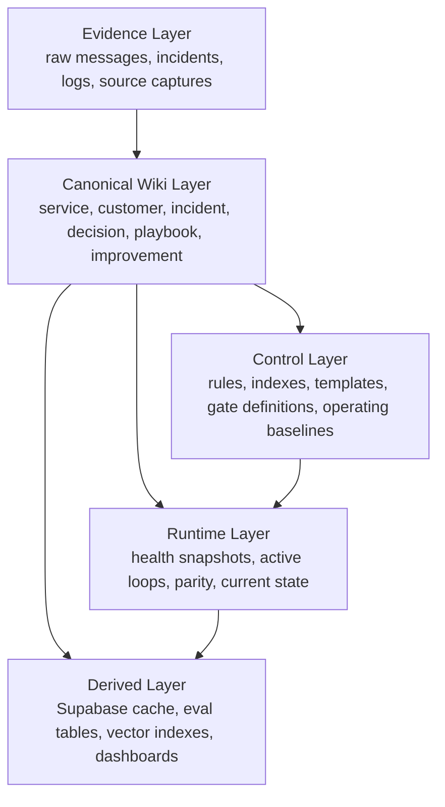

# Obsidian Operating System Blueprint

Status:

- Proposed reference architecture for an Obsidian-centered operating system.
- Meant to align the live vault, runtime surfaces, control rules, and derived stores around one visible working space.
- Complements, but does not replace, the current runtime truth in `docs/ARCHITECTURE_INDEX.md`, `docs/RUNTIME_NAME_AND_SURFACE_MATRIX.md`, and `config/runtime/operating-baseline.json`.

## 1. Objective

Turn the vault into a living operating workspace for:

- enterprise/service knowledge
- customer and guild context
- quality and failure analysis
- recursive self-improvement
- operator-facing runtime visibility
- development-process archaeology and multi-repo context

The intent is not "more notes." The intent is one visible system where evidence, decisions, incidents, customers, services, and improvement loops can be inspected and maintained in the same graph.

## 2. Non-Goals

- replacing runtime code with markdown
- treating LLM-written summaries as the only truth
- forcing all operational state into Obsidian when a derived store is materially better for speed
- breaking current vault roots or the current desktop-visible synced vault

## 3. Design Principles

1. Evidence first.
   - Raw evidence must stay inspectable and must not be overwritten by synthesis.
2. Visible truth beats hidden truth.
   - If operators cannot inspect it in the vault, it is not a trustworthy control surface.
3. Graph first, vector second.
   - Retrieval should follow links, object relationships, and canonical indexes before semantic fallback.
4. Same-vault semantics.
   - A write is only successful if it lands in the actual synced user-visible vault.
5. Derived stores stay derived.
   - Supabase caches, indexes, eval tables, and summaries accelerate the system but do not outrank the vault's semantic meaning.
6. Object-first organization.
   - The system should revolve around a small set of durable object types, not an ever-growing list of feature-specific folders.

## 4. North Star

Obsidian becomes the human-visible operating system of the platform.

- The vault is the place where a person can inspect what the system knows.
- MCP, workers, and external OSS tools are the execution layer.
- Supabase is the acceleration, audit, and aggregation layer.
- Runtime routes are the diagnostic mirror of the same operating graph.

## 5. Five-Layer Architecture

### 5.1 Evidence Layer

Purpose:

- hold immutable or append-only source material
- preserve provenance
- let synthesis point back to concrete facts

Examples:

- Discord threads and transcripts
- customer reports
- postmortem evidence
- benchmark outputs
- quality reviews
- external articles and research captures

Rule:

- Evidence may be annotated, but it must remain attributable and reconstructible.

### 5.2 Canonical Wiki Layer

Purpose:

- represent the stable operating graph the agent and operator reason over
- host durable objects such as services, customers, incidents, decisions, playbooks, improvements, repository contexts, and development slices

This is the main layer the LLM should update and traverse.

### 5.3 Control Layer

Purpose:

- describe how the system should behave
- expose policy, indexes, schemas, operating baselines, and query entrypoints

Examples:

- operating baselines
- decision matrices
- canonical object schemas
- vault indexes and generated maps
- path contracts and note conventions

### 5.4 Runtime Layer

Purpose:

- show what is true right now
- mirror runtime snapshots into a human-readable graph

Examples:

- active loops
- current service health
- vault parity state
- recent incidents
- unresolved risk markers

### 5.5 Derived Layer

Purpose:

- speed up search, ranking, dashboards, and automation
- support auditability and operational reporting

Examples:

- Supabase cache
- retrieval-eval tables
- weekly reports
- vector indexes
- dashboards

Rule:

- A derived store may be stale. The canonical wiki may not silently inherit that staleness as truth.

## 6. Canonical Operating Loops

### 6.1 Ingest

New evidence enters the vault, gets normalized, linked, and merged into canonical objects.

Expected outputs:

- a source note or equivalent evidence artifact
- updated entity/object pages
- updated index entry
- appended activity log

### 6.2 Query

Questions should resolve from canonical objects first, then follow evidence links, then fall back to derived search.

### 6.3 Lint

The system periodically checks:

- broken relationships
- orphan objects
- stale claims
- conflicting decisions
- missing evidence links
- runtime/control mismatches

### 6.4 Operate

Operational state is surfaced into the vault so an operator can inspect:

- what is active
- what is degraded
- what changed
- what action the system recommends next

### 6.5 Improve

Every improvement object should bind together:

- the failure or gap
- the proposed change
- the validation rule
- the rollout state
- the regression outcome

## 7. Steady-State Vault Topology

This is the target logical shape, not a requirement to rename everything immediately.

### 7.1 Stable Roots

- `sources/` — immutable or append-only evidence captures
- `ops/services/` — service profiles and runtime contracts
- `ops/contexts/repos/` — repository and external context objects
- `ops/incidents/` — incidents, outages, failure evidence, postmortem drafts
- `ops/playbooks/` — operator procedures and remediation guides
- `guilds/` — guild, customer, relationship, and topology context
- `plans/decisions/` — architecture and decision records
- `plans/development/` — bounded development slices and change archaeology
- `improvements/` — change proposals, regressions, and validation state
- `_control/` — schemas, indexes, routing rules, generated maps
- `_runtime/` — mirrored runtime snapshots and current-state summaries

### 7.2 Compatibility Mapping From Current Roots

The current vault already uses roots such as `chat/`, `guilds/`, `ops/`, `plans/`, and `retros/`.

Near-term interpretation:

- `chat/` becomes evidence ingress, not the final semantic object layer
- `guilds/` remains the guild and customer context hub
- `ops/` remains the service, incident, runtime, and playbook hub
- `plans/` becomes the decision and blueprint layer
- repo-wide `.github`, `scripts`, `config`, ADR, and gate artifacts should converge through repository-context or development-slice notes instead of remaining semantically disconnected
- `retros/` should feed `improvements/` rather than staying a terminal dead-end archive

## 8. Current Runtime Alignment

The repository already contains partial implementation of this blueprint.

### 8.1 Already aligned

- graph-first retrieval contract in `docs/contracts/OBSIDIAN_READ_LOOP.md`
- knowledge-control runtime surface in `GET /api/bot/agent/runtime/knowledge-control-plane`
- vault-aware runtime diagnostics in `GET /api/bot/agent/obsidian/runtime`
- fail-closed write semantics in `writeObsidianNoteWithAdapter()`
- operating baseline manifest in `config/runtime/operating-baseline.json`

### 8.2 Still fragmented

- control logic is split across runbook, SOP, env, runtime JSON, and vault structure
- dual persistence remains in several flows
- object types are implicit rather than explicitly standardized
- retros and improvements are not yet one operating object family
- repo-wide process knowledge is still spread across docs, `.github`, scripts, config, and gate outputs with no single archaeology layer

## 9. What Makes This More Elegant Than The Current Shape

1. Fewer truths.
   - The operator does not have to reconcile five separate partial control planes by hand.
2. Better links.
   - Service, customer, incident, decision, and improvement objects can be traversed naturally in the graph.
3. Better self-improvement.
   - A retro becomes a structured improvement artifact instead of a prose endpoint.
4. Better runtime visibility.
   - Operators can verify not just health, but meaning and alignment.
5. Better OSS composability.
   - OpenClaw, OpenJarvis, OpenShell, and MCP stay execution modules, not accidental schema owners.

## 10. Success Conditions

The blueprint is working when all of the following become true:

1. Every important decision links to evidence, impacted service/customer objects, and a next action.
2. Every incident page links to affected services, customer impact, recovery playbook, and follow-up improvement.
3. Every improvement page links back to the failure pattern and forward to validation evidence.
4. A runtime mismatch can be seen from the vault without reading environment files first.
5. Derived systems can be rebuilt without losing the semantic operating graph.
6. A new service or external repo can be onboarded through a repository-context note plus linked development slices instead of ad hoc prose.

## 11. Recommended Companion Documents

- `docs/planning/OBSIDIAN_OBJECT_MODEL.md`
- `docs/planning/OBSIDIAN_TRANSITION_PLAN.md`
- `docs/contracts/OBSIDIAN_READ_LOOP.md`
- `docs/ARCHITECTURE_INDEX.md`
- `docs/RUNBOOK_MUEL_PLATFORM.md`
